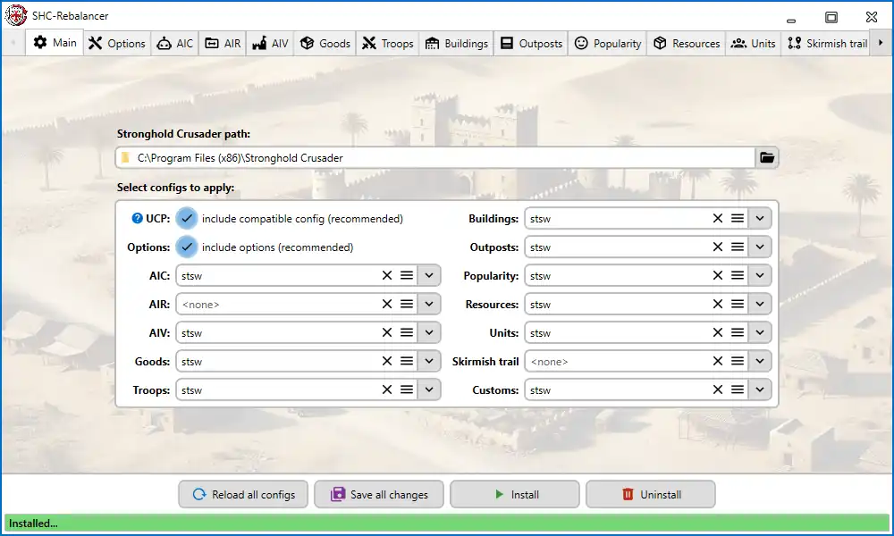
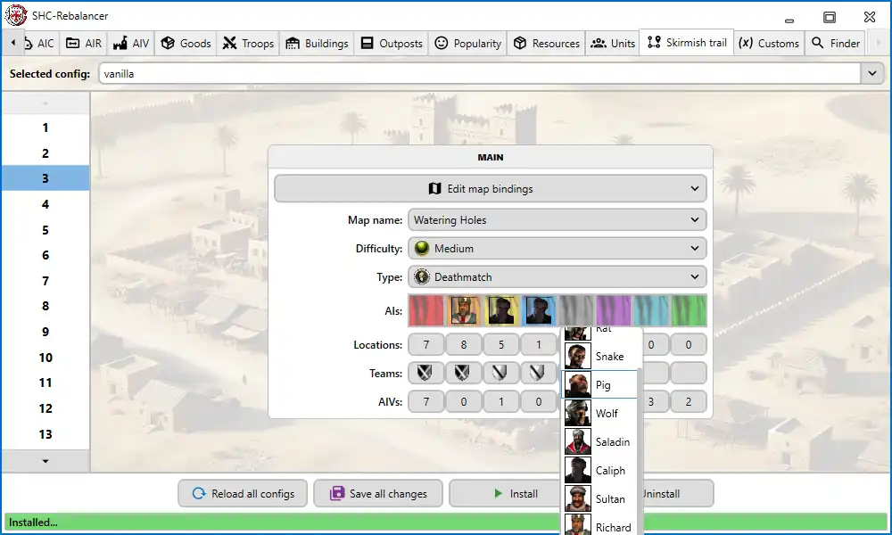

# SHC-Rebalancer

The **SHC-Rebalancer** is a powerful tool designed to modify and rebalance various aspects of the games **Stronghold Crusader** and **Stronghold Crusader Extreme**. This includes tweaking the properties of buildings, units, resources, and more by directly overwriting the bytes of the game’s executable file. Additionally, the tool features a built-in search engine for locating and modifying specific addresses and values within the `.exe` file.

This program is inspired by **UnofficialCrusaderPatch 2.15** and incorporates some of its features. It has been developed and tested specifically for **Stronghold Crusader version 1.41**.

## Features

- **Comprehensive Rebalancing**: Adjust values for buildings, units, resources, and other game elements.
- **Executable File Editing**: Apply changes directly to the game's `.exe` file.
- **Address Search Engine**: Find and edit specific values within the `.exe` file based on customizable search parameters.
- **User-Friendly Interface**: Navigate through intuitive tabs to manage settings and edits efficiently.
- - **Built-in Compatibility Options**: Includes configurations inspired by UnofficialCrusaderPatch for standalone use.

## Screenshots

### Main Tab
The main tab allows you to specify game paths and select which settings to apply to the `.exe` file.

### Search Engine
Locate specific addresses and values in the `.exe` file by specifying search parameters.

### Properties Tabs
View and modify properties of specific categories, such as buildings, units, or skirmish trail.

## Getting Started

### Prerequisites
- **Supported Games**: Stronghold Crusader and Stronghold Crusader Extreme
- **Game Version**: Stronghold Crusader 1.41
- **Operating System**: Windows 7 or higher
- **.NET Runtime**: .NET 8

### Installation
1. Clone or download this repository to your local machine.
2. Run the provided executable file to launch the tool.

### Usage
1. Open the application and navigate to the **Main Tab**.
2. Specify the game’s installation directory.
3. Select the settings to apply from the list.
4. Use additional tabs, such as **Unit Properties** and **Search Engine**, to fine-tune adjustments.
5. Apply the changes to the `.exe` file.

### Compatibility Notes
- The tool features a compatibility mode (`UCP: include compatible config`) inspired by UnofficialCrusaderPatch, which applies specific settings to the `.exe` file.  
- Enabling this mode makes the Rebalancer work independently of UnofficialCrusaderPatch, requiring a clean, unmodified `.exe` file.  
- Disabling this mode allows compatibility with other modification tools but may result in issues like address conflicts. Be cautious when combining features such as "AIC" or custom address changes without reviewing base addresses in the `Resources/base` directory.

## Warnings and Recommendations
- **Backup Your Files**: Always back up your game’s `.exe` file before applying changes to avoid data loss or corruption.
- **No Guarantees**: The tool modifies files directly, and its functionality is not guaranteed, especially under specific or unsupported use cases.
- **Standalone Use**: For the best results, use this tool on a clean, unmodified game installation. Avoid using other modification programs simultaneously unless compatibility is ensured.
- **Caution with Custom Addresses**: If you disable compatibility mode, be mindful of address conflicts. Verify and adjust base addresses if necessary.

## Development
Contributions to this project are welcome! If you would like to contribute:
1. Fork the repository.
2. Create a new branch for your feature or bugfix.
3. Commit your changes and push them to your fork.
4. Open a pull request explaining your changes.

## Disclaimer
This tool modifies game files directly and should be used responsibly. Always back up your game files before applying changes. The creators of this tool are not responsible for any issues that may arise from its use.

## License
This project is licensed under the MIT License. See the [LICENSE](./LICENSE) file for details.

## Acknowledgments
- Firefly Studios for creating Stronghold Crusader and Stronghold Crusader Extreme.
- The developers of **UnofficialCrusaderPatch 2.15** for inspiration and select features.
- The gaming community for feedback and encouragement.

---
Enjoy rebalancing your Stronghold Crusader experience with this tool!
