English version soon...

W tym artykule opisane s¹ konfiguracje `stsw` - co zmieniaj¹ oraz dlaczego.

# Rebalans budynków, jednostek, surowców
Poni¿ej znajduj¹ siê opisy zmian w budynkach (koszty i wytrzyma³oœci), jednostkach (obra¿enia, wytrzyma³oœæ, koszt, szybkoœæ itp.), surowcach (ceny), wp³ywie na popularnoœæ, spawnie jednostek przez posterunki itp.

## Surowce

Ceny wszystkich surowców w grze zosta³y zmienione by zbalansowaæ gospodarkê i zwiêkszyæ ró¿norodnoœæ strategii.
Dotychczas handel by³ zbyt op³acalny, a ceny kupna i sprzeda¿y zbyt op³acalne, co sprawia³o, ¿e handel by³ dominuj¹c¹ strategi¹ w grze.
Wprowadzenie zmian ma na celu zbalansowanie gospodarki i zwiêkszenie ró¿norodnoœci strategii.
Wiêkszoœæ towarów ma teraz cenê sprzeda¿y mniejsz¹ ni¿ 50% ceny zakupu, co sprawia, ¿e handel jako g³ówne Ÿród³o dochodu jest mniej op³acalny.
Ceny zakupu wielu surowców zosta³y zwiêkszone, co sprawia, ¿e surowce bardziej ni¿ wczeœniej op³aca siê wydobywaæ, a nie kupowaæ - kupno by³o zbyt ³atwe i wygodne w oryginalnej grze - nowe podejœcie sprawia, ¿e o wiele bardziej op³aca siê ryzykowaæ walkê o z³o¿a surowców z innymi graczami jeœli na mapie s¹ po³o¿one w konkurencyjnych miejscach.
Ceny sprzeda¿y wielu surowców zosta³y zmniejszone, co sprawia, ¿e celem wydobycia bardziej ni¿ wczeœniej jest ich wykorzystanie do produkcji jednostek i budynków, a nie sprzeda¿.
Dodatkowo niektóre ceny zosta³y zaokr¹glone do wygodnych wartoœci, by u³atwiæ graczom zapamiêtanie ich i porównywanie.
Poni¿ej wa¿niejsze zmiany i wyjaœnienia dla konkretnych surowców:

###  Wood
Cena zakupu drewna zosta³a zwiêkszona.
Gracze nie dbali o liczbê drzew na mapie, poniewa¿ drewno by³o tanie i ³atwe do zdobycia.
Powodowa³o to, ¿e w przypadku ograniczonego dostêpu do drzew, gracze nie odczuwali problemu z brakiem drewna, poniewa¿ mogli je ³atwo kupiæ.
Kupowanie drewna na pocz¹tku gry nale¿a³o do najczêstszych strategii, poniewa¿ pozwala³o szybko rozwin¹æ gospodarkê.
Zwiêkszenie ceny drewna sprawia, ¿e gracze:
- musz¹ zastanowiæ siê czy na starcie gry bardziej op³aca im siê kupiæ drewno, czy poczekaæ za pierwsz¹ dostaw¹ od drwali
- musz¹ bardziej dbaæ o to, by nie wycinaæ wszystkich drzew na mapie, poniewa¿ drewno jest teraz bardziej ograniczone i nie mo¿na go ³atwo kupiæ
- chêtniej bêd¹ ryzykowaæ walkê o z³o¿a drewna z innymi graczami, poniewa¿ drewno jest teraz bardziej op³acalne do wydobycia ni¿ do kupienia

###  Stone
Cena zakupu i sprzeda¿y kamienia zosta³a zmniejszona.
Kamienio³omy produkuj¹ du¿e iloœci kamienia, a jego cena by³a zbyt wysoka, co sprawia³o, ¿e kamienio³omy by³y zbyt op³acalne i dominuj¹ce w grze.
Zmniejszenie wartoœci kamienia sprawia, ¿e kamieñ nie ma ju¿ monopolu na op³acalnoœæ wydobycia, a jego cena jest bardziej zbalansowana wzglêdem innych surowców.

###  Iron
Cena zakupu i sprzeda¿y ¿elaza zosta³a zmniejszona.
Graj¹c z w³¹czon¹ opcj¹, w której pracownicy nios¹ po dwie sztabki ¿elaza zamiast jednej sprawia, ¿e wydobycie ¿elaza z ma³o op³acalnego sta³o siê zbyt op³acalne.
Zmiana cen balansuje ¿elazo zachowuj¹c jego op³acalnoœæ wydobycia i mniejsz¹ op³acalnoœæ sprzeda¿y.
Ceny ¿elaza s¹ ujednolicone z cen¹ smo³y, by ustanowiæ ¿elazo jako g³ówny dodatkowy surowiec po stronie europejskiej (drewno + kamieñ + ¿elazo), a smo³ê po stronie arabskiej (drewno + kamieñ + smo³a).

###  Pitch
Cena zakupu smo³y zosta³a zwiêkszona.
W grze smo³a by³a zbyt tania, a wydobycie powolne i ma³o op³acalne, co sprawia³o, ¿e gracze woleli kupowaæ smo³ê zamiast j¹ wydobywaæ.
Zwiêkszenie ceny smo³y sprawia, ¿e wydobycie smo³y jest bardziej op³acalne, a gracze musz¹ bardziej dbaæ o z³o¿a smo³y na mapie, a tak¿e bardziej op³aca siê walczyæ o z³o¿a smo³y z innymi graczami.
Ceny smo³y s¹ ujednolicone z cen¹ ¿elaza, by ustanowiæ smo³ê jako g³ówny dodatkowy surowiec po stronie arabskiej (drewno + kamieñ + smo³a), a ¿elazo po stronie europejskiej (drewno + kamieñ + ¿elazo).

###  Bread / Cheese / Meat / Fruit
Ceny sprzeda¿y chleba, sera, miêsa i owoców zosta³y zmniejszone.
W oryginalnej grze, szczególnie w przypadku chleba, czêsto op³aca³o siê sprzedawaæ te surowce zamiast ustawiaæ dodatkowe racje w spichlerzu, co trochê mija siê z celem tych surowców.
Niski koszt kupna zosta³ zachowany na potrzeby przeciwników AI nieprodukuj¹cych tych surowców (tak, o tobie mowa Su³tan), którzy musieliby spêdzaæ fortunne na zakup tych surowców i w efekcie nie rozwijaliby siê wystarczaj¹co szybko lub ich gospodarka by zbankrutowa³a.

###  Beer
Cena zakupu piwa zosta³a zwiêkszona.
W grze piwo by³o zbyt tanie, co mog³o powodowaæ, ¿e w przypadku problemów z jego produkcj¹, gracze decydowali siê na jego zakup co w po³¹czeniu ze œci¹gniêciem wiêkszych podatków za funkcjonowanie karczm sprawia³o, ¿e nie mia³o to konsekwencji finansowych.

###  Leather
Cena zakupu zbroi skórzanych zosta³a znacznie zwiêkszona.
W oryginalnej grze zbroje skórzane by³y zbyt tanie, co sprawia³o, ¿e zbyt czêsto je kupowano a nie tylko produkowano czyni¹c je ³atwo dostêpnymi.
Wp³ywa³o to na ³atwiejszy dostêp do jednostek korzystaj¹cych z tych zbroi, szczególnie kuszników, którzy byli zbyt powszechnie u¿ywani.
Nowa cena bardziej zmusza graczy do produkcji zbroi skórzanych, w efekcie hodowli byd³a i podejmowania dzia³añ w celu ich ochrony przed atakami przeciwników, co zwiêksza dynamikê gry i ró¿norodnoœæ strategii.

## Budynki

Wszystkie budynki w grze zosta³y zbalansowane, szczególnie pod k¹tem kosztów, poniewa¿ niektóre budynki by³y zbyt drogie i z tego powodu nie by³y u¿ywane, a inne by³y zbyt tanie i z tego powodu by³y zbyt powszechne.
Wszystkie rzeczy przyjemne i przygnêbiaj¹ce kosztuj¹ 50 sztuk z³ota zamiast ró¿nej iloœci. Ka¿da z tych rzeczy jest dodatkowo tym wytrzymalsza im wiêcej miejsca na mapie zajmuje. Takie ustawienie powinno byæ bardziej intuicyjne dla gracza.
Zbalansowano wytrzyma³oœci budynków wzglêdem ich kosztów, poniewa¿ w oryginalnej grze niektóre budynki by³y zbyt wytrzyma³e jak na swoj¹ cenê, a inne by³y zbyt s³abe.
Wiêkszoœæ wie¿ i bram jest teraz wytrzymalsza, ale kosztuje wiêcej kamienia do budowy.
Poni¿ej wa¿niejsze zmiany i wyjaœnienia dla konkretnych budynków:

###  Barracks
Koszt koszar zosta³ zmniejszony, poniewa¿ wymaga³y zbyt du¿ej iloœci kamienia jak na budynek, który jest stawiany na pocz¹tku gry, szczególnie jeœli porówna siê jego koszt do obozu najemników, który jest alternatywnym budynkiem do rekturacji jednostek, tyle ¿e po stronie arabskiej.

### 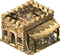 TunnelersGuild
Koszt gildii tunelarzy zosta³ zmniejszony, poniewa¿ jest to budynek w którym mo¿na rekturowaæ jedynie tunelarzy, a jest to zbyt specyficzna jednostka, by budynek ten by³ tak drogi.

### 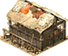 Stables
Koszt stajni zosta³ zmniejszony, poniewa¿ trzeba w niego by³o zainwestowaæ du¿o z³ota po czym koszt rycerzy by³ bardzo niski, co psu³o balans gry.
Zmniejszenie kosztu stajni sprawia, ¿e rycerze s¹ bardziej dostêpni, ale ich koszt zosta³ znacznie zwiêkszony, co sprawia, ¿e pierwsza rekturacja rycerzy jest ³¹cznie mniej kosztowna, ale kolejne rekrutacje s¹ znacznie dro¿sze, co zapobiega ich masowej produkcji i dominacji w grze.
Dodatkowo koszt budowy stajni zosta³ zmniejszony, by zachêciæ do produkcji rycerzy, ale jednoczeœnie zbalansowaæ ich si³ê.

### 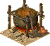 OilSmelter
Koszt kot³a z olejem zosta³ znacznie zmniejszony, poniewa¿ in¿ynier z wrz¹cym olejem jest zbyt beznadziejn¹ jednostk¹ co w po³¹czeniu z drogim kosztem budowy kot³a sprawia³o, ¿e by³ on ma³o u¿ywany.
Zmniejszenie kosztu budowy kot³a sprawia, ¿e in¿ynier z wrz¹cym olejem jest odrobinê bardziej op³acalny w rekrutacji.

### 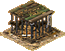 CagedWarDogs
Koszt klatki dla psów wojennych nie zawiera ju¿ drewna, poniewa¿ w oryginalnej grze koszt budowy klatki by³ zbyt wysoki, co sprawia³o, ¿e psy wojenne by³y ma³o u¿ywane.
Zmniejszenie kosztu budowy klatki sprawia, ¿e psy wojenne s¹ bardziej dostêpne i mog¹ byæ u¿ywane czêœciej.

###  EuropOutpost / ArabOutpost
Wytrzyma³oœæ posterunków zosta³a podwojona, poniewa¿ w oryginalnej grze by³y one zbyt ³atwe do zniszczenia, a bior¹c pod uwagê fakt, ¿e by³y u¿ywane w misjach bez przeciwników AI bez mo¿liwoœci ich odbudowywania, za bardzo u³atwia³o to misje.

### 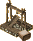 Quarry
Koszt kamienio³omu zosta³ zwiêkszony, by wymaga³ wiêcej drewna i by³ bardziej odpowiedni do jego rozmiaru. Dodatkowo bior¹c pod uwagê jego u¿ytecznoœæ, jest to odpowiednia zmiana.

### 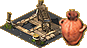 PitchRig
Koszt odkrywki smo³y zosta³ zmniejszony, by dodatkowo zachêciæ do jej wydobycia, poniewa¿ w oryginalnej grze by³o to ma³o op³acalne.

###  Marketplace
Targowisko jest teraz darmowe, poniewa¿ jest to najwa¿niejszy budynek w grze, a jego strata lub po prostu brak zwykle powodowa³o przechylenie szal zwyciêstwa na stronê przeciwnika, poniewa¿ handel jest istotnym elementem gry, szczególnie dla przeciwników AI.
Wytrzyma³oœæ budynku zosta³a mocno zmniejszona by dopasowaæ j¹ do braku kosztu budowy.

### 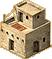 Hovel / KillingPits
Koszt chaty i wilczego do³u zosta³ zmniejszony, by dopasowaæ koszt do bardziej wygodnej liczby.

###  Chapel / Church / Cathedral
Koszt budowy kaplicy, koœcio³a i katedry zosta³ zmodyfikowany aby wymaga³ kamienia, ale za to mniej z³ota.
W oryginalnej grze budynki te by³y zbyt drogie, szczególnie dla przeciwników AI, którzy czêsto mieli problem uzbieraæ 1000 sztuk z³ota (tak, o tobie mowa Opat).
Szczególnie tañszy jest koszt budowy kaplicy, poniewa¿ jest to najliczniej budowany budynek religijny, a jego koszt by³ zbyt wysoki.
Dodatkowo progi b³ogos³awieñstw zosta³y zmniejszone u³atwiaj¹c zebranie bonusów za liczbê b³ogos³awionych, co by³o problematyczne przy du¿ej liczbie populacji.
Sta³y bonus popularnoœci za katedrê zosta³ o po³owê zmniejszony, poniewa¿ w oryginalnej grze by³ zbyt wysoki, co sprawia³o, ¿e katedra by³a zbyt op³acalna i dominuj¹ca w grze i ze wszystkich trzech budynków religijnych by³a najczêœciej budowana pierwsza by uzyskaæ bardzo op³acalne bonusy.
Po zmianie w bonusie katedry gracz musi zastanowiæ siê czy bardziej op³aca mu siê jako pierwsz¹ budowaæ katedrê - jest dro¿sza i wymaga wiêcej miejsca na mapie, ale pozwala dodatkowo rekrutowaæ mnichów - czy koœció³ - jest tañszy i mniejszy, wiêc bardziej op³acalny jeœli nie ma potrzeby rekrutacji mnichów.

### 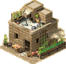 Apothecary
Koszt budynku uzdrowiciela zosta³ zwiêkszony, poniewa¿ w opcjach Rebalancera w³¹czony jest tryb w którym pracownik tego budynku ma mo¿liwoœæ leczenia jednostek.
Sprawia to, ¿e z bezu¿ytecznego budynku sta³ siê a¿ nadto u¿yteczny, szczególnie ¿e leczenie dzia³a równie¿ na lorda.
Na szczêœcie w przeciwieñstwie do Stronghold Crusader DE, budynek zabiera du¿o miejsca na mapie i oferuje po jednym pracowniku, wiêc mechanika leczenia jest moim zdaniem bardziej zbalansowana ni¿ w DE, gdzie istnieje jednostka Medyka, któr¹ mo¿na rekrutowaæ w dowolnych iloœciach i przemieszczaæ po mapie.

### 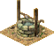 Well / WaterPot
Koszt studni zmieniony ze z³ota na kamieñ, a koszt z³ota dla kot³a z wod¹ zwiêkszony.
W oryginalnej grze kocio³ z wod¹ by³ bardziej op³acalny, poniewa¿ oferuje 3 pracowników zamiast 1 jak studnia, a koszt by³ tylko dwukrotnie wiêkszy.
Nowa wersja kosztów sprawia, ¿e to dostêpnoœæ surowca decyduje o tym, czy bardziej op³aca siê budowaæ studniê czy kocio³ z wod¹.

###  Mill
Koszt m³yna zosta³ zmniejszony, poniewa¿ wymaga³ zbyt du¿ej iloœci drewna.
Przeciwnicy AI mieli czêsto problemy z uzbieraniem odpowiedniej iloœci drewna, co sprawia³o, ¿e m³yn by³ zbyt póŸno budowany i przeciwnicy AI mieli problem z produkcj¹ chleba, co sprawia³o, ¿e czasami siada³a im gospodarka i nie mogli siê rozwijaæ.

## Jednostki

Wszystkie jednostki w grze zosta³y zbalansowane, aby zwiêkszyæ ró¿norodnoœæ strategii i taktyk, a tak¿e poprawiæ ogóln¹ grywalnoœæ.
Prawie wszystkie jednostki maj¹ zmniejszone obra¿enia przeciwko murom i wie¿om - w grze obra¿enia te by³y zbyt du¿e, co by³o zbyt nienaturalne i niezgodne z rzeczywistoœci¹, oraz powodowa³o, ¿e czêsto machiny oblê¿nicze by³y niepotrzebne. Wprowadzenie tego zmniejszenia obra¿eñ ma na celu zwiêkszenie u¿ytecznoœci machin oblê¿niczych, które s¹ teraz bardziej potrzebne do niszczenia murów.
Prawie wszystkie jednostki maj¹ zmniejszone obra¿enia przeciwko budynkom - w grze obra¿enia te by³y nawet wiêksze, przez co rajdy na budynki produkcyjne takie jak kamienio³omy czy kopalnie by³y zbyt skuteczne.
Prawie wszystkie jednostki dystansowe i dystansowe machiny maj¹ zmniejszony zasiêg ataku - w grze jednostki dystansowe mia³y zbyt du¿y zasiêg ataku, co powodowa³o, ¿e by³y zbyt silne i dominuj¹ce w grze, szczególnie bior¹c pod uwagê, ¿e mapy w grze s¹ wzglêdnie ma³e.
Prawie wszystkie jednostki dystansowe maj¹ zmniejszone obra¿enia w walce wrêcz - wynika to z faktu, ¿e jednostki dystansowe powinny byæ u¿ywane g³ównie do walki na odleg³oœæ, a nie w zwarciu - ta zmiana dodatkowo wymusza na graczu unikanie konfrontacji jednostek dystansowych z jednostkami wrêcz.
Jednostki dystansowe u¿ywaj¹ce ró¿nego rodzaju broni (³uki, kusze, proce) maj¹ zmodyfikowane obra¿enia przeciwko jednostkom o ró¿nym pancerzu - w grze nie by³o takiego podzia³u, a kusznicy mieli wysokie obra¿enia przeciwko wszystkim jednostkom, przez co wypierali inne jednostki dystansowe - wprowadzenie tego podzia³u ma na celu zwiêkszenie ró¿norodnoœci jednostek dystansowych i ich u¿ytecznoœci w ró¿nych sytuacjach, w za³o¿eniu:
- ³ucznicy maj¹ byæ skuteczni przeciwko jednostkom bez pancerza lub z lekkim pancerzem, ale ma³o skuteczni przeciwko jednostkom z ciê¿kim pancerzem
- kusznicy maj¹ byæ skuteczni przeciwko jednostkom z lekkim lub ciê¿kim pancerzem, ale ma³o skuteczni przeciwko jednostkom bez pancerza
- procarze maj¹ byæ skuteczni przeciwko jednostkom bez pancerza lub z ciê¿kim pancerzem, ale ma³o skuteczni przeciwko jednostkom z lekkim pancerzem

Koszty wiêkszoœci jednostek europejskich zosta³y zwiêkszone, poniewa¿ mimo wymogu produkcji broni, jednostki te by³y zbyt tanie, co sprawia³o, ¿e by³y za czêsto wybierane przez graczy w stosunku do arabskich jednostek, które by³y zbyt drogie w szerszej perspektywie.
Du¿o jednostek cywilnych (robotników) ma zmniejszon¹ wytrzyma³oœæ i obra¿enia w walce wrêcz - te jednostki powstaj¹ automatycznie i za darmo, wiêc ich si³a by³a zbyt du¿a w porównaniu do niektórych jednostek wojskowych, a ich wytrzyma³oœæ jest problematyczna dla jednostek o ma³ych obra¿eniach jak w³ócznicy czy pikinierzy.
Prawie wszystkie machiny s¹ teraz dro¿sze w produkcji i dodatkowo kosztuj¹ drewno oprócz z³ota, jednak s¹ bardziej wytrzyma³e, szczególnie na ostrza³, co sprawia, ¿e s¹ bardziej op³acalne w produkcji i u¿yciu, a tak¿e bardziej zbalansowane wzglêdem jednostek walcz¹cych wrêcz, i sprawiaj¹ wra¿enie potê¿niejszych wywieraj¹c nale¿yt¹ presjê podczas oblê¿enia zamku przeciwnika.
Poni¿ej wa¿niejsze zmiany i wyjaœnienia dla konkretnych jednostek:

### 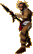 Spearman
W³ócznik w oryginalnej grze jest zbyt s³ab¹ jednostk¹, aby w ogóle by³ u¿ywany - jest bardzo tani, ale nie ma ¿adnej przewagi nad innymi jednostkami.
Dlatego wprowadzono nastêpuj¹ce zmiany:
- Jednostka zawsze jest w trybie biegu, co pozwala na szybsze przemieszczanie siê po mapie. Wczeœniej jednostka by³a w trybie chodzenia, co powodowa³o, ¿e mocno odstawa³a w mobilnoœci od innych jednostek bez pancerza.
- Otrzymywane obra¿enia od broni dystansowych zmniejszone. Celem jest zwiêkszenie szansy przetrwania jednostki, poniewa¿ ginêli oni zbyt szybko od jednostek dystansowych, czêsto zanim zdo³ali dojœæ do przeciwnika lub murów czy budynków.
- Zadawane obra¿enia zwiêkszone, poniewa¿ by³y tak niewielkie, ¿e niekiedy by³y na równi z niektórymi pracownikami jak drwale, a nawet mieli problem przebiæ siê przez kmiotów do lorda przeciwnika.
- Wprowadzono dodatkowy bonus do obra¿eñ przeciwko kawalerii (szczególnie konnym ³ucznikom). W grze nie by³o takiego bonusu, a powszechnie w³ócznicy s¹ kojarzeni z walk¹ przeciwko konnicy. Wprowadzenie tego bonusu ma na celu zwiêkszenie ich u¿ytecznoœci i unikalnoœci w grze. Wiêksze obra¿enia przeciwko konnym ³ucznikom ni¿ rycerzom ma na celu rozró¿nienie ich od pikinierów.
- Koszt lekko zwiêkszony. Spowodowane tym, ¿e jednostka jest teraz bardziej u¿yteczna i ma wiêksze szanse na przetrwanie, a tak¿e zadaje wiêksze obra¿enia. Zwiêkszenie kosztu ma na celu zbalansowanie tej jednostki.

### 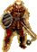 Maceman
Pa³karz w oryginalnej grze jest dobr¹ jednostk¹, ale podobnie jak inne jednostki walcz¹ce wrêcz, jest zbyt s³aby przeciwko jednostkom dystansowym. Dodatkowo zbyt dobr¹ alternatyw¹ dla niego by³ asasyn, który mia³ wiêksze obra¿enia i unikalne umiejêtnoœci. Dlatego wprowadzono nastêpuj¹ce zmiany:
- Wytrzyma³oœæ zwiêkszona, by jednostka by³a chêtniej u¿ywana w walce.
- Kara do obra¿eñ w walce ze zbrojnymi i rycerzami zosta³a znacznie zmniejszona, by daæ wiêksz¹ szansê na przetrwanie w walce z nimi. W oryginalnej grze kara ta by³a zbyt du¿a, co sprawia³o, ¿e pa³karze byli zbyt niewydajni w walce z nimi.
- Zadawane obra¿enia przeciwko mnichom zwiêkszone o 40% - jest to nawi¹zanie do fabu³y pierwszej czêœci gry, gdzie przeciwnik AI "Wieprz" próbowa³ pozbyæ siê mnichów, a pa³karze s¹ uto¿samiani z tym przeciwnikiem. Dodatkowo mnisi s¹ w grze silni, wiêc dodanie kontry do nich ma na celu zwiêkszenie u¿ytecznoœci jednostki.
- Zadawane obra¿enia przeciwko machinom zwiêkszone o 100% - machiny s¹ obecnie bardzo wytrzyma³e, wiêc ustanowienie tej jednostki obok rycerzy jako kontrê do machin ma na celu zwiêkszenie ich u¿ytecznoœci.
- Koszt zwiêkszony, poniewa¿ jednostka jest teraz bardziej u¿yteczna i ma wiêksze szanse na przetrwanie, a tak¿e zadaje wiêksze obra¿enia. Zwiêkszenie kosztu ma na celu zbalansowanie tej jednostki.

### 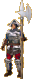 Pikeman
Pikinierzy w oryginalnej grze s¹ dobr¹ jednostk¹, ale posiadaj¹ podobny problem do w³óczników - maj¹ niewielkie obra¿enia i zbyt ma³o unikalnoœci poza tym, ¿e s¹ najwytrzymalsz¹ jednostk¹. Dlatego wprowadzono nastêpuj¹ce zmiany:
- Zadawane obra¿enia zwiêkszone (mimo, ¿e celem jednostki jest tankowanie obra¿eñ), poniewa¿ by³y tak niewielkie, ¿e niekiedy by³y na równi z niektórymi pracownikami jak drwale, a nawet mieli problem przebiæ siê przez kmiotów do lorda przeciwnika.
- Wprowadzono dodatkowy bonus do obra¿eñ przeciwko kawalerii (szczególnie rycerzom). W grze nie by³o takiego bonusu, a powszechnie pikinierzy s¹ kojarzeni z walk¹ przeciwko konnicy. Wprowadzenie tego bonusu ma na celu zwiêkszenie ich u¿ytecznoœci i unikalnoœci w grze. Wiêksze obra¿enia przeciwko rycerzom ni¿ konnym ³ucznikom ma na celu rozró¿nienie ich od w³óczników.
- Koszt zwiêkszony, poniewa¿ jednostka jest teraz bardziej u¿yteczna i zadaje wiêksze obra¿enia. Zwiêkszenie kosztu ma na celu zbalansowanie tej jednostki.

###  Swordsman
Zbrojny w oryginalnej grze jest siln¹ jednostk¹, ale zbyt powolny i ma³o wytrzyma³y przeciwko kusznikom, co czyni go ma³o u¿ytecznym. Dodatkowo ³atwo zabiæ go przez pu³apki, ogieñ i pociski z machin oblê¿niczych, co sprawia, ¿e ginie szybciej ni¿ jest w stanie dojœæ do murów przeciwnika. Dlatego wprowadzono nastêpuj¹ce zmiany:
- Prêdkoœæ ruchu i wytrzyma³oœæ zwiêkszone, by jednostka mia³a wiêksz¹ mobilnoœæ i prze¿ywalnoœæ i mia³a wiêksz¹ szansê nie tylko dotrzeæ do przeciwnika lub murów, ale równie¿ przebiæ siê do zamku przeciwnika.
- Otrzymywane obra¿enia od ³uków i proc zwiêkszone, by zrekompensowaæ zwiêkszon¹ mobilnoœæ i wytrzyma³oœæ jednostki. W oryginalnej grze obra¿enia te by³y zbyt ma³e, co powodowa³o, ¿e kusznicy byli zbyt silni w walce przeciwko zbrojnym w porównaniu do innych jednostek dystansowych.
- Zachowano karê do obra¿eñ w walce z innymi zbrojnymi i rycerzami, by walki miêdzy nimi trwa³y d³u¿ej i by³y bardziej spektakularne.

### 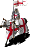 Knight
Rycerz w oryginalnej grze jest bardzo siln¹ jednostk¹, ale próg wejœcia jest zbyt kosztowny, co sprawia, ¿e albo nie jest u¿ywany, albo jest u¿ywany i dominuj¹cy w grze, poniewa¿ po zainwestowaniu w budowy stajni jest ³atwy do wyprodukowania. Dlatego wprowadzono nastêpuj¹ce zmiany:
- Koszt znacznie zwiêkszony, by rycerz by³ bardziej kosztowny w produkcji i nie by³ tak powszechny. W zamian koszt budowy stajni zosta³ zmniejszony, by zachêciæ do produkcji rycerzy, ale jednoczeœnie zbalansowaæ ich koszt w nastêpnych rekrutacjach.
- Wytrzyma³oœæ w walce wrêcz zwiêkszona, by lekko zrekompensowaæ zwiêkszony koszt jednostki.
- Otrzymywanie obra¿eñ od ³uków i proc zwiêkszone, by uspójniæ je ze zbrojnymi. W oryginalnej grze obra¿enia te by³y zbyt ma³e, co powodowa³o, ¿e kusznicy byli zbyt silni w walce przeciwko rycerzom w porównaniu do innych jednostek dystansowych.
- Zachowano karê do obra¿eñ w walce z innymi zbrojnymi i rycerzami, by walki miêdzy nimi trwa³y d³u¿ej i by³y bardziej spektakularne.

###  ArabArcher
Arabscy ³ucznicy w oryginalnej grze s¹ znacznie silniejsi od europejskich ³uczników, ale ich koszt by³ zbyt wysoki, co sprawia³o, ¿e europejscy ³ucznicy byli bardziej powszechni. Dlatego znacznie zmniejszono ich koszt.

###  Slave
Niewolnik w oryginalnej grze jest bardzo s³ab¹ jednostk¹, co w teorii jest sensowne i prawid³owe, ale w praktyce sprawia, ¿e jednostka ta jest bezu¿yteczna i ginie zbyt szybko a nie op³aca siê ich masowa rekrutacja. Dlatego wprowadzono nastêpuj¹ce zmiany:
- Otrzymywane obra¿enia od broni dystansowych zmniejszone o oko³o po³owê, by zwiêkszyæ szansê przetrwania jednostki, poniewa¿ ginêli oni zbyt szybko od jednostek dystansowych, czêsto zanim zdo³ali dojœæ do budynków przeciwnika.
- Nie otrzymuje ju¿ zwiêkszonych obra¿eñ w walce wrêcz od innych jednostek.
- Koszt podwojony, by zrekompensowaæ zwiêkszon¹ szansê przetrwania jednostki. W teorii wychodzi na to samo, ale w praktyce rekrutacja liczby niewolników o tej samej sile trwa teraz dwa razy krócej oraz rzadziej jest powodem osi¹gania dostêpnego limitu jednostek, co sprawia, ¿e powinni byæ chêtniej u¿ywani w grze. Dodatkowo zwiêkszony koszt zapobiega exploitowi ze zwalnianiem niewolników, by zwiêkszyæ liczbê mieszkañców w celu szybkiego œci¹gniêcia du¿ych podatków.

###  Slinger
Procarz w oryginalnej grze jest mylnie uznawany za s³ab¹ jednostkê ze wzglêdu na ich unikalnoœæ i zbyt niestandardowe sytuacje, w których potrafi¹ byæ u¿yteczni. Dlatego wprowadzono nastêpuj¹ce zmiany:
- Zwiêkszona u¿ytecznoœæ w walce dystansowej - zgodnie z jedn¹ z wczeœniejszych informacji, procarze maj¹ teraz w za³o¿eniu byæ u¿yteczniejsi przeciwko jednostkom bez pancerza lub z ciê¿kim pancerzem.
- W przeciwieñstwie do innych jednostek dystansowych, procarze nie otrzymali kary do zasiêgu ataku, poniewa¿ ich zasiêg jest ju¿ niewielki i nie ma potrzeby go zmniejszaæ.
- Zadaje mniejsze obra¿enia w walce wrêcz, ale nie otrzymuje ju¿ zwiêkszonych obra¿eñ w walce wrêcz od innych jednostek.
- Koszt lekko zwiêkszony, by zrekompensowaæ zwiêkszon¹ u¿ytecznoœæ jednostki.

### 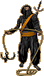 Assassin
Asasyn w oryginalnej grze jest niesamowicie potê¿n¹ i u¿yteczn¹ jednostk¹ ze wzglêdu na swoje unikalne umiejêtnoœci (niewidzialnoœæ, wspinanie siê po murach) oraz wysokie obra¿enia. Dlatego wprowadzono nastêpuj¹ce zmiany:
- Zmieniono logikê zadawania obra¿eñ by zadawa³ tym wiêcej obra¿eñ im mniej opancerzony jest przeciwnik, ale tym mniej obra¿eñ im bardziej opancerzony jest przeciwnik, poniewa¿ asasyn mia³ wysokie obra¿enia przeciwko wszystkim jednostkom, co sprawia³o, ¿e by³ zbyt silny i dominuj¹cy w grze. Ta zmiana sprawia, ¿e jest bardziej unikalny i wymaga wiêkszej strategii w u¿yciu.
- Zmniejszenie obra¿eñ przeciwko jednostkom z ciê¿kim pancerzem dodatkowo sprawia, ¿e próba zabicia wrogiego lorda na pocz¹tku gry jest ju¿ niemal niemo¿liwa - fakt ten by³ wykorzystywany w oryginalnej grze, by szybko wygraæ potyczki z przeciwnikami AI. Dodatkowo startowe z³oto gracza zosta³o zmniejszone, a przeciwnicy AI maj¹ wiêcej jednostek startowych co dodatkowo zabezpiecza przed szybkim wyeliminowaniem przeciwnika.

###  HorseArcher
Konny ³ucznik w oryginalnej grze jest niesamowicie potê¿n¹ i u¿yteczn¹ jednostk¹ ze wzglêdu na swoj¹ unikaln¹ umiejêtnoœæ (strzelanie podczas ruchu) co z wysok¹ mobilnoœci¹ sprawia, ¿e jest bardzo trudny do z³apania przez jednostki walcz¹ce wrêcz. Dlatego wprowadzono nastêpuj¹ce zmiany:
- Prêdkoœæ ruchu zmniejszona, by jednostka by³a ³atwiejsza do z³apania przez jednostki walcz¹ce wrêcz. W oryginalnej grze jednostka ta by³a zbyt szybka, co sprawia³o, ¿e by³a zbyt dominuj¹ca w grze.
- Wytrzyma³oœæ zwiêkszona, otrzymywanie obra¿eñ od broni dystansowych zwiêkszone - obie te zmiany po to aby uspójniæ je z arabskimi ³ucznikami.

###  ArabSwordsman
Arabski zbrojny w oryginalnej grze ma sporo wad - bardzo szybko ginie od kuszników oraz europejskich zbrojnych. Dlatego wprowadzono nastêpuj¹ce zmiany:
- Prêdkoœæ ruchu zwiêkszona, by jednostka by³a bardziej mobilna i mog³a szybciej dotrzeæ do przeciwnika lub murów.
- Otrzymywane obra¿enia od kusz znacznie zmniejszone, by zwiêkszyæ szansê przetrwania jednostki, poniewa¿ ginêli oni zbyt szybko od kuszników, czêsto zanim zdo³ali dojœæ do przeciwnika lub murów.
- Europejscy zbrojni i rycerze maj¹ karê do obra¿eñ równie¿ w walce z arabskimi zbrojnymi a nie tylko na odwrót, w przeciwieñstwie do oryginalnej gry, dziêki czemu walka miêdzy nimi jest bardziej sprawiedliwa i zbalansowana.

Dotychczas walka z europejskimi przeciwnikami by³a dla arabskich lordów bardzo trudna i niesprawiedliwa, poniewa¿ europejscy zbrojni mieli karê do obra¿eñ przeciwko arabskim zbrojnym, ale nie odwrotnie.
Dodatkowo kusznicy byli zbyt skuteczni przeciwko arabskim zbrojnym, co sprawia³o, ¿e walka z europejskimi przeciwnikami by³a bardzo trudna i niesprawiedliwa.
Wprowadzenie tych zmian ma na celu zwiêkszenie szansy arabskich lordów na walkê z europejskimi przeciwnikami.

###  Firethrower
Miotacz ognia w oryginalnej grze jest bardzo siln¹ jednostk¹, choæ trochê niedocenian¹ ze wzglêdu na niski zasiêg ataku. Dlatego wprowadzono nastêpuj¹ce zmiany:
- Otrzymywane obra¿enia od ³uków i szczególnie od proc zwiêkszone, by jej u¿ycie by³o bardziej ryzykowne i dawa³o wiêksz¹ szansê in¿ynierom z wrz¹cym olejem do bycia alternatyw¹ do miotaczy ognia.
- Koszt zwiêkszony, by ograniczyæ ich produkcjê, poniewa¿ w oryginalnej grze stosunek ceny do si³y by³ zbyt niski, co sprawia³o, ¿e strata ich podczas bitwy by³a zbyt ma³o odczuwalna, a ich obecnoœæ niedoceniana.

### 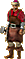 Engineer
In¿ynier w oryginalnej grze, choæ ma³o wytrzyma³y, jest relatywnie zbalansowan¹ jednostk¹. Jednak in¿ynier z wrz¹cym olejem jest jedn¹ z najbardziej beznadziejnych jednostek w grze, a niestety wspó³dzieli te same statystyki ze zwyk³ym in¿ynierem. Dlatego wprowadzono nastêpuj¹ce zmiany:
- Wytrzyma³oœæ znacznie zwiêkszona, by zwiêkszyæ szansê przetrwania jednostki, poniewa¿ ginêli oni zbyt szybko od jednostek dystansowych, czêsto zanim zdo³ali dojœæ do namiotu oblê¿niczego. Natomiast in¿ynier z wrz¹cym olejem, który w teorii ma byæ alternatyw¹ do miotacza ognia, pada³ na 3 trafienia z ³uku, podczas gdy miotacz ognia na 6.

###  Ladderman
Drabiniarz w oryginalnej grze, podobnie jak in¿ynier z wrz¹cym olejem, jest jedn¹ z najbardziej beznadziejnych jednostek w grze. Dlatego wprowadzono nastêpuj¹ce zmiany:
- Wytrzyma³oœæ znacznie zwiêkszona, by zwiêkszyæ szansê przetrwania jednostki, poniewa¿ ginêli oni zbyt szybko od jednostek dystansowych, czêsto zanim zdo³ali dojœæ do murów przeciwnika. S¹ teraz oko³o trzykrotnie bardziej wytrzymali na broñ dystansow¹, co sprawia, ¿e maj¹ znacznie wiêksz¹ szansê na dotarcie do murów przeciwnika i pozostanie przy ¿yciu by inne jednostki mog³y siê wspi¹æ po drabinach.
- Prawie wszystkie jednostki mog¹ teraz wspinaæ siê po drabinach. W oryginalnej grze tylko niektóre jednostki mog³y to robiæ, co by³o nielogiczne, poniewa¿ jednostki piesze powinny byæ w stanie wspinaæ siê po drabinach. Wprowadzenie tej zmiany ma na celu zwiêkszenie u¿ytecznoœci drabiniarzy, którzy powinni byæ tañsz¹ i szybsz¹ alternatyw¹ dla wie¿ oblê¿niczych.
- Koszt znacznie zwiêkszony, by zrekompensowaæ zwiêkszon¹ szansê przetrwania jednostki. Dodatkowo zwiêkszony koszt zapobiega exploitowi ze zwalnianiem drabiniarzy, by zwiêkszyæ liczbê mieszkañców w celu szybkiego œci¹gniêcia du¿ych podatków.

###  Tunneler
Tunelarz w oryginalnej grze jest jedn¹ z najbardziej beznadziejnych jednostek w grze, poniewa¿ jest ma³o wytrzyma³y, trudny w u¿yciu, jego umiejêtnoœæ kopania tuneli jest ma³o u¿yteczna, a na dodatek wymaga specjalnego budynku do rekrutacji. Dlatego wprowadzono nastêpuj¹ce zmiany:
- Otrzymywane obra¿enia od broni dystansowych znacznie zmniejszone, by zwiêkszyæ szansê przetrwania jednostki, poniewa¿ ginêli oni zbyt szybko od jednostek dystansowych, czêsto zanim zdo³ali wykopaæ tunel.
- Zadawane obra¿enia zmniejszone, poniewa¿ walka wrêcz nie powinna byæ ich g³ówn¹ rol¹, a zwiêkszenie wytrzyma³oœci rekompensuje zmniejszenie obra¿eñ.
- Obra¿enia zadawane murom i wie¿om zosta³y znacznie zwiêkszone (najwiêksze jeœli nie liczyæ machin oblê¿niczych) czyni¹c jednostkê bardziej unikaln¹ i u¿yteczn¹, daj¹c jej alternatywê - kopanie tunelu z bezpiecznej odleg³oœci, ale z mniejszym zniszczeniem murów, lub ryzykowne podejœcie do murów, ale z wiêkszym zniszczeniem.

### 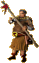 Monk
Mnich w oryginalnej grze jest przeciêtnie siln¹ czy wytrzyma³¹ jednostk¹, ale jego koszt jest tak niewielki, ¿e jest najbardziej op³acaln¹ w rekrutacji jednostk¹ w grze. Mimo niewielkiej prêdkoœci ruchu, mo¿na go skutecznie wykorzystaæ równie¿ w ofensywie, co sprawia, ¿e jest zbyt silny. Dlatego wprowadzono nastêpuj¹ce zmiany:
- Koszt podwojony, by zmniejszyæ ich op³acalnoœæ w rekrutacji. W oryginalnej grze mnisi byli tak tanimi, ¿e czêsto by³y jedyn¹ jednostk¹ produkowan¹ przez graczy, co sprawia³o, ¿e by³y zbyt silne i dominuj¹ce w grze.
- Otrzymywane obra¿enia od broni dystansowych lekko zmniejszone, by zrekompensowaæ zwiêkszony koszt jednostki. Zmniejszono jednak mocno obra¿enia od procarzy, co czyni mnichów dobr¹ kontr¹ przeciwko nim.
- Zadawane obra¿enia w walce wrêcz zmniejszone, poniewa¿ jak na jednostkê o s³abym wyposa¿eniu, zadaj¹ oni zbyt du¿e obra¿enia, co jest nielogiczne, a tak¿e czyni ich zbyt silnymi ofensywnie.

###  WarDog
Pies wojenny w oryginalnej grze jest s³ab¹ jednostk¹, a koszt budowy klatki by³ zbyt wysoki, co sprawia³o, ¿e inne pu³apki jak np. wilcze do³y by³y znacznie bardziej op³acalne. Dlatego wprowadzono nastêpuj¹ce zmiany:
- Prêdkoœæ ruchu zwiêkszona, by jednostka by³a bardziej mobilna i mog³a szybciej dotrzeæ do przeciwnika. Jest to dodatkowo bardziej logiczne, poniewa¿ psy wojenne powinny byæ szybkie i zwinne w porównaniu do ludzi.
- Wytrzyma³oœæ w walce wrêcz zwiêkszona, by zwiêkszyæ u¿ytecznoœæ jednostki.
- Zadawane obra¿enia przeciwko zabójcom zwiêkszone o 100%. Dodaje to unikalnoœci i u¿ytecznoœci jednostce, dodatkowo znacznie u³atwiaj¹c wykrycie asasynów, którzy domyœlnie s¹ niewidzialni. U³atwia to ochronê bram i murów, jednoczeœnie zmuszaj¹c przeciwnika do rozs¹dniejszego u¿ywania zabójców.

### 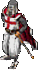 Lord
Lord w oryginalnej grze mo¿e byæ sterowany przez gracza, co w po³¹czeniu z jego wysok¹ wytrzyma³oœci¹ i obra¿eniami sprawia, ¿e jest on u¿ywany ofensywnie, co jest nielogiczne, poniewa¿ lord powinien byæ chroniony i nie powinien braæ udzia³u w walce. Dlatego wprowadzono nastêpuj¹ce zmiany:
- Zadawane obra¿enia w walce wrêcz znacznie zmniejszone, by lord by³ bardziej defensywny i nie by³ u¿ywany ofensywnie.
- Otrzymywane obra¿enia od broni dystansowych zmniejszone, by bardziej zmusiæ wroga do u¿ycia jednostek walcz¹cych wrêcz do szturmu na zamek zamiast ostrzeliwania lorda z bezpiecznej odleg³oœci. Jest to równie¿ rekompensata za zmniejszenie obra¿eñ w walce wrêcz.
- Zadawane obra¿enia budynkom zmniejszone o po³owê w porównaniu do innych jednostek, poniewa¿ lord nie powinien wychodziæ z zamku, by niszczyæ budynki przeciwnika.

### 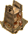 SiegeTower
Wie¿a oblê¿nicza w oryginalnej grze jest bardzo siln¹ machin¹ oblê¿nicz¹, jeœli przeciwnik ma szeroko rozstawione mury i nie u¿ywa fosy. Drabiniarze po zmianach s¹ nienajgorsz¹ alternatyw¹ do wie¿y oblê¿niczej, ale mimo to wymaga modyfikacji. Dlatego wprowadzono nastêpuj¹ce zmiany:
- Szybkoœæ ruchu znacznie zmniejszona, by daæ wiêcej czasu jednostkom wrêcz na zniszczenie jej zanim dotrze do murów przeciwnika, oraz daæ jej dodatkow¹ wadê wzglêdem drabiniarzy.
- Wytrzyma³oœæ znacznie zwiêkszona, poniewa¿ machiny oblê¿nicze powinny byæ wytrzyma³e i trudne do zniszczenia, szczególnie przez pociski z ³uków, kusz czy proc. Jest to dodatkowo rekompensata za zmniejszenie szybkoœci ruchu.
- Kosztuje wiêcej z³ota i dodatkowo wymaga drewna do budowy, co sprawia, ¿e jest dro¿sza w produkcji by zrekompensowaæ zwiêkszon¹ wytrzyma³oœæ. Umacnia to drabiniarzy jako tañsz¹, ale bardziej ryzykown¹ alternatywê do wie¿y oblê¿niczej.

### 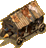 BatteringRam
Taran w oryginalnej grze jest prawdopodobnie najmniej u¿yteczn¹ machin¹ oblê¿nicz¹, poniewa¿ jest bardzo ³atwy do zniszczenia nie tylko przez jednostki wrêcz, ale równie¿ przez jednostki dystansowe, a w przeciwieñstwie do innych machin oblê¿niczych, wymaga dojœcia do murów przeciwnika, co czyni go ³atwym celem. Dlatego wprowadzono nastêpuj¹ce zmiany:
- Szybkoœæ ruchu zmniejszona, by daæ wiêcej czasu jednostkom wrêcz na zniszczenie go zanim dotrze do murów przeciwnika.
- Wytrzyma³oœæ na ataki dystansowe znacznie zwiêkszona, poniewa¿ machiny oblê¿nicze powinny byæ wytrzyma³e i trudne do zniszczenia przez pociski z ³uków, kusz czy proc.
- Kosztuje wiêcej z³ota i dodatkowo wymaga drewna do budowy, co sprawia, ¿e jest dro¿sza w produkcji by zrekompensowaæ zwiêkszon¹ wytrzyma³oœæ.

###  PortableShield
Przenoœna tarcza w oryginalnej grze to niepozorna, ale niesamowicie u¿yteczna machina oblê¿nicza. Jednak jej koszt jest zbyt niski, co sprawia, ¿e jest zbyt ³atwa do produkcji. Dlatego wprowadzono nastêpuj¹ce zmiany:
- Szybkoœæ ruchu zmniejszona, by opóŸniæ dotarcie chronionych jednostek do murów przeciwnika.
- Przenoœnych tarcz nie mo¿na ju¿ stawiaæ na murach i wie¿ach, poniewa¿ defensywa wzbogacona o te machiny oblê¿nicze by³a zbyt silna i trudna do prze³amania i balans gry mocno na tym cierpia³.
- Jest bardziej wytrzyma³a na pociski z kuszy, ale mniej na pociski z procy.
- Kosztuje wiêcej z³ota i dodatkowo wymaga drewna do budowy, co sprawia, ¿e jest dro¿sza w produkcji.

# Przeciwnicy AI
Poni¿ej znajduj¹ siê opisy zmian w oryginalnych 16 przeciwnikach AI a potem opisy 16 nowych przeciwników AI.
Opisy obejmuj¹ zachowanie przeciwnika od gospodarki przez sposób budowy zamku na strategii bitewnej koñcz¹c.

##  Rat

Przybli¿ony poziom trudnoœci: **25%**  
Typ lorda: **Europ**  
Si³a fizyczna: **50%**  
Cel ataku: **gracz**  

### Charakter

Rat jest bardzo s³abym przeciwnikiem AI, który nie ma ¿adnej strategii i nie jest w stanie zbudowaæ silnej gospodarki ani defensywy.
Jest to przeciwnik, który ma byæ ³atwy do pokonania i s³u¿y jako wprowadzenie do gry.
Jego jedyn¹ si³¹ jest liczba jednostek oraz czêste ataki, które zmuszaj¹ gracza do podjêcia szybkich decyzji na pocz¹tkowych etapach gry.
Jest to wiêc przeciwnik, którego jedynym celem jest bycie denerwuj¹cym dla gracza, ale nie stanowi on ¿adnego wyzwania.

### Zamek

Buduje ma³y zamek w kszta³cie kwadratu z bardzo ma³¹ liczb¹ ma³ych wie¿ i bram.
Nie stosuje ¿adnych pu³apek a zamek nie posiada znacz¹cych s³abych ani silnych punktów - nie ma wiêc znaczenia czy gracz atakuje zamek frontalnie, bokiem czy ty³em.

### Gospodarka

Gospodarka Rat jest bardzo s³aba i opiera siê g³ównie na produkcji ¿ywnoœci i taniej broni.
Nie ma ¿adnych specjalnych budynków ani technologii, które by zwiêksza³y jego przychody z wyj¹tkiem kilku rzeczy przyjemnych, które jednak nie maj¹ wiêkszego wp³ywu na jego grê.

### Strategia bitewna

Rat to przeciwnik bardzo agresywny, który czêsto atakuje ju¿ na pocz¹tku gry, ale nie ma wyraŸnie defensywnego lub ofensywnego stylu gry - zarówno jego ataki jak i obrona s¹ chaotyczne i nieprzemyœlane.
G³ównymi jednostkami Rat s¹ w³ócznicy i ³ucznicy, którzy s¹ produkowani w du¿ych iloœciach. Jednostki te s¹ u¿ywane zarówno do obrony, ataku jak i rajdów na gospodarkê przeciwnika.
Podczas ataków dodatkowo wspiera siê drabiniarzami, którzy pozwalaj¹ jego w³ócznikom dostaæ siê na mury przeciwnika (mo¿na ich skontrowaæ w³ócznikami).
Rzadko u¿ywa machin oblê¿niczych, a jeœli ju¿ to s¹ to pojedyncze katapulty.
Jego ofensywê mo¿na skontrowaæ zwyk³ymi ³ucznikami, a defensywê prze³amaæ w bardzo podobny sposób. Nie s¹ wymagane ¿adne specjalne jednostki ani strategie.

##  Snake

Przybli¿ony poziom trudnoœci: **30%**  
Typ lorda: **Europ**  
Si³a fizyczna: **70%**  
Cel ataku: **najs³abszy przeciwnik**  

### Charakter

Snake jest przeciwnikiem AI, który jest nieco silniejszy od Rata, ale nadal nie jest w stanie zbudowaæ silnej gospodarki ani defensywy.
Podobnie jak Rat, Snake jest przeciwnikiem, który ma byæ ³atwy do pokonania i s³u¿y jako wprowadzenie do gry.
Podobnie jak Rat, jego jedyn¹ si³¹ jest liczba jednostek oraz czêste ataki, które zmuszaj¹ gracza do podjêcia szybkich decyzji na pocz¹tkowych etapach gry.
Jednak w przeciwieñstwie do Rat, Snake jest bardziej przebieg³y ze wzglêdu na u¿ywanie niewolników, procarzy, a nawet asasynów, by nêkaæ gospodarkê gracza.

### Zamek

Buduje ma³y zamek w kszta³cie litery S z ma³¹ liczb¹ niedu¿ych wie¿ i bram.
Kopie fosê dooko³a wie¿ i bram, ale nie zabezpiecza murów, co sprawia ¿e nadal ³atwo jest w³amaæ siê do jego zamku.
Podobnie jak w przypadku Rat, jego zamek nie posiada znacz¹cych s³abych ani silnych punktów - nie ma wiêc znaczenia czy gracz atakuje zamek frontalnie, bokiem czy ty³em.

### Gospodarka

Gospodarka Snake jest nieco lepsza od Rata, ale nadal opiera siê g³ównie na produkcji ¿ywnoœci i taniej broni.
Nie ma ¿adnych specjalnych budynków ani technologii, które by zwiêksza³y jego przychody.

### Strategia bitewna

Snake to przeciwnik bardzo agresywny, który czêsto atakuje ju¿ na pocz¹tku gry, ale nie ma wyraŸnie defensywnego lub ofensywnego stylu gry. Stosuje jednak nieco bardziej przemyœlane ataki i obronê ni¿ Rat.
G³ównymi jednostkami Snake s¹ w³ócznicy, ³ucznicy i procarze, którzy s¹ produkowani w du¿ych iloœciach. Jednostki te s¹ u¿ywane zarówno do obrony jak i ataku, ale w przeciwieñstwie do Rat, Snake czêsto u¿ywa niewolników do nêkania gospodarki przeciwnika.
Podczas ataków dodatkowo wspiera siê drabiniarzami, którzy pozwalaj¹ jego w³ócznikom dostaæ siê na mury przeciwnika (mo¿na ich skontrowaæ w³ócznikami).
Rzadko u¿ywa machin oblê¿niczych, a jeœli ju¿ to s¹ to pojedyncze katapulty.
Jego ofensywê mo¿na skontrowaæ zwyk³ymi ³ucznikami, a defensywê prze³amaæ w bardzo podobny sposób. Nie s¹ wymagane ¿adne specjalne jednostki ani strategie.

##  Pig

Przybli¿ony poziom trudnoœci: **55%**  
Typ lorda: **Europ**  
Si³a fizyczna: **100%**  
Cel ataku: **najbogatszy przeciwnik**  

### Charakter

Pig jest okrutnym przeciwnikiem AI, który jest w stanie zbudowaæ zarówno siln¹ defensywê jak i ofensywê.
Jest to przeciwnik, który ma stanowiæ œrednie wyzwanie dla gracza i wymaga od niego bardziej przemyœlanej strategii ni¿ prosty szturm na zamek.
Pig charakteryzuje siê brutalnym stylem gry, który polega na masowej produkcji jednostek i atakowaniu przeciwnika bez wiêkszego planu.

### Zamek

Jego zamek nie przypomina prostego kszta³tu - jest to bardziej skomplikowana konstrukcja z kilkoma wie¿ami ró¿nych rozmiarów i ma³ymi bramami. Du¿e wie¿e obsadzone s¹ mangonelami.
U¿ywa wilczych do³ów, ale nie u¿ywa innego rodzaju pu³apek, co sprawia ¿e jego zamek jest ³atwy do prze³amania, mimo otoczenia go dodatkowymi murami.
Jego zamek ma kilka s³abych punktów, ale równie¿ kilka silnych punktów, co sprawia ¿e atakowanie go jest bardziej skomplikowane i wymaga wiêkszej strategii.

### Gospodarka

Gospodarka Pig nie jest jego mocn¹ stron¹, ale jest wystarczaj¹co silna, by pozwoliæ mu na masow¹ produkcjê jednostek.
Jedyn¹ charakterystyczn¹ cech¹ jego gospodarki jest produkcja du¿ej iloœci ¿ywnoœci, co jest szczególnie podkreœlone gdy na mapie wystêpuje zwierzyna, poniewa¿ umo¿liwia mu to dodatkowe pozyskanie miêsa.
Nie ma ¿adnych specjalnych budynków ani technologii, które by zwiêksza³y jego przychody z wyj¹tkiem kilku rzeczy przygnêbiaj¹cych, które jednak nie maj¹ wiêkszego wp³ywu na jego grê.

### Strategia bitewna

Pig to przeciwnik, którego oblê¿enia s¹ brutalne i chaotyczne, ale nieprzemyœlane.
G³ównymi jednostkami Pig s¹ pa³karze i kusznicy. Jednostki te s¹ u¿ywane zarówno do obrony, ataku jak i rajdów na gospodarkê przeciwnika.
Podczas ataków dodatkowo wspiera siê drabiniarzami, którzy pozwalaj¹ jego pa³karzom dostaæ siê na mury przeciwnika (mo¿na ich skontrowaæ w³ócznikami).
Czêsto u¿ywa machin oblê¿niczych, szczególnie katapult i taranów, które s¹ u¿ywane do szybkiego zniszczenia murów i bram przeciwnika.
Jego ofensywê mo¿na skontrowaæ ³ucznikami lub kusznikami, wspomagaj¹c siê w walce wrêcz pikinierami.
Jego defensywê mo¿na prze³amaæ w nastêpuj¹cy sposób:
- kuszników mo¿na pokonaæ na 2 sposoby: bardziej bezpoœredni to pikinierów (mnichów unikamy jeœli wróg ma du¿o pa³karzy), którzy s¹ nieŸli w tankowaniu obra¿eñ z kuszy, lub mniej bezpoœredni to u¿ycie asasynów, którzy zwykle mog¹ zabiæ kuszników zanim ci zd¹¿¹ oddaæ wystarczaj¹co du¿o strza³ów
- pa³karzy w tym scenariuszu nie pokonamy zbrojnymi czy rycerzami ze wzglêdu na wystêpowanie kuszników, ale mo¿emy u¿yæ jednostek dystansowych, lub równie¿ pa³karzy

##  Wolf

Przybli¿ony poziom trudnoœci: **100%**  
Typ lorda: **Europ**  
Si³a fizyczna: **150%**  
Cel ataku: **najbli¿szy przeciwnik**  

### Charakter

Wolf jest najsilniejszym przeciwnikiem AI, który jest w stanie zbudowaæ zarówno siln¹ gospodarkê, groŸn¹ ofensywê jak i nieprzeniknion¹ defensywê.
Jest to przeciwnik, który ma stanowiæ ogromne wyzwanie dla gracza i wymaga od niego przemyœlanej strategii oraz umiejêtnoœci zarz¹dzania zasobami.
Jego styl gry jest bardzo zrównowa¿ony, co sprawia, ¿e jest trudny do pokonania. Nie atakuje czêsto - woli zbieraæ jednostki i przeprowadzaæ du¿e szturmy, które s¹ trudne do odparcia.

### Zamek

Buduje ogromny zamek w kszta³cie prostok¹ta wbudowanego w kolejny prostok¹t. Wewnêtrzny prostok¹t jest obudowany niemal absurdalnie du¿¹ iloœci¹ du¿ych wie¿ oraz posiada kilka bram.
Zarówno wewnêtrzny jak i zewnêtrzny prostok¹t posiada grube, wielowarstwowe mury, które s¹ trudne do prze³amania. Na wie¿ach stoj¹ zarówno kusznicy, ³ucznicy, mangonele i balisty wie¿owe.
U¿ywa wszelkich dostêpnych pu³apek jak fosa (zarówno na zewn¹trz jak i wewn¹trz zamku), wilcze do³y, smolne rowy, klatki z psami wojennymi, in¿ynierów z wrz¹cym olejem, oraz balist ogniowych.
Jego zamek nie posiada s³abych punktów sprawiaj¹c, ¿e atakowanie go jest bardzo trudne i wymaga przemyœlanej strategii.

### Gospodarka

Gospodarka Wolf jest bardzo silna i zrównowa¿ona, co sprawia, ¿e odciêcie go od jakiegokolwiek Ÿród³a przychodu nie pogarsza znacz¹co jego sytuacji.
Jego gospodarka opiera siê na produkcji nienajgorszej iloœci ¿ywnoœci, broni, wydobyciu surowców, a tak¿e otrzymuje dodatkowe przychody za religiê i funkcjonowanie karczm.
Stosuje spor¹ liczbê rzeczy przygnêbiaj¹cych, które dodatkowo wzmacniaj¹ jego gospodarkê i przychody z niej, i choæ wp³ywa to negatywnie na morale jego wojska, to przy sile jego defensywy nie daje znacz¹cej przewagi jego przeciwnikom.

### Strategia bitewna

Wolf to przeciwnik, którego zarówno obrona jak i atak s¹ jednymi z najlepszych w grze. Nie atakuje bezmyœlnie, ale raczej zbiera jednostki i przeprowadza du¿e szturmy, które s¹ trudne do odparcia.
Wolf korzysta z du¿ego zró¿nicowania jednostek, ale nie nale¿¹ do nich jednostki arabskie co eliminuje kilka przebieg³ych strategii z jego strony.
G³ównymi jednostkami Wolf s¹ kusznicy, ³ucznicy, zbrojni, pikinierzy, a nawet pa³karze. Zbrojni s¹ jego g³ówn¹ si³¹ ofensywn¹, pikinierzy s¹ znacz¹cym elementem jego defensywy a tak¿e s³u¿¹ do kopania fosy (zarówno swojej jak i wroga), a pa³karze s¹ u¿ywani do nêkania gospodarki przeciwnika.
U¿ywa du¿ej iloœci zró¿nicowanych machin oblê¿niczych: katapult, balist ogniowych, trebuszy, taranów, wie¿ oblê¿niczych.
Jego ofensywa jest zró¿nicowana, ale ze wzglêdu na du¿¹ liczbê zbrojnych, poleca siê u¿ycie kuszników.
Jego defensywa jest bardzo trudna do prze³amania i wymaga przemyœlanej strategii oraz sporej liczby jednostek.

##  Saladin

Przybli¿ony poziom trudnoœci: **95%**  
Typ lorda: **Arab**  
Si³a fizyczna: **140%**  
Cel ataku: **najbogatszy przeciwnik**  

### Charakter

Saladin jest bardzo silnym przeciwnikiem AI, który jest w stanie zbudowaæ zarówno siln¹ gospodarkê, groŸn¹ ofensywê jak i nieprzeniknion¹ defensywê.
Jest to przeciwnik, który ma stanowiæ bardzo du¿e wyzwanie dla gracza i wymaga od niego przemyœlanej strategii oraz umiejêtnoœci zarz¹dzania zasobami.
Jego styl gry jest bardzo zrównowa¿ony, co sprawia, ¿e jest trudny do pokonania. Nie atakuje czêsto - woli zbieraæ jednostki i przeprowadzaæ du¿e szturmy, które s¹ trudne do odparcia.
Jednak na pocz¹tku gry skupia siê przede wszystkim na budowie gospodarki, co sprawia, ¿e gracz nie musi obawiaæ siê szybkiego pierwszego ataku.

### Zamek

Buduje du¿y zamek w kszta³cie kwadratu z wieloma du¿ymi wie¿ami na przodzie. Mury jego zamku s¹ grube i wielowarstwowe, co sprawia, ¿e s¹ trudne do prze³amania. Na wie¿ach umieszcza zarówno mangonele jak i balisty wie¿owe.
U¿ywa wszelkim dostêpnych pu³apek jak fosa, wilcze do³y, smolne rowy, klatki z psami wojennymi, miotaczy ognia, oraz balist ogniowych.
Jego zamek jest niemal nie do przebicia od frontu i bardzo trudny do prze³amania z boku, ale z ty³u obrona jest bardzo s³aba, co sprawia, ¿e zaatakowanie go od ty³u jest jedyn¹ s³uszn¹ strategi¹, pod warunkiem, ¿e teren to umo¿liwia.

### Gospodarka

Gospodarka Saladin jest bardzo silna i zrównowa¿ona, co sprawia, ¿e odciêcie go od jakiegokolwiek Ÿród³a przychodu nie pogarsza znacz¹co jego sytuacji.
Jego gospodarka opiera siê na produkcji ogromnej iloœci ¿ywnoœci, a tak¿e na sporym wydobyciu surowców, a tak¿e otrzymuje dodatkowe przychody za funkcjonowanie karczm.
Stosuje spor¹ liczbê rzeczy przyjemnych, które mo¿e i wp³ywaj¹ negatywnie na jego godspodarkê i przychody z niej, ale wp³ywaj¹ pozytywnie na morale jego wojska, co sprawia ¿e jego wojsko jest silne.

### Strategia bitewna

Saladin to przeciwnik, którego obrona jest prawdopodobnie najlepsza w grze. Nie atakuje bezmyœlnie, ale raczej zbiera jednostki i przeprowadza du¿e szturmy, które s¹ trudne do odparcia.
Saladin korzysta z du¿ego zró¿nicowania jednostek, ale nie nale¿¹ do nich jednostki europejskie co zmniejsza jego bezpoœredni¹ si³ê ofensywn¹, ale pozwala mu na stosowanie przebieg³ych strategii.
G³ównymi jednostkami Saladin s¹ arabscy ³ucznicy, konni ³ucznicy, arabscy zbrojni, a nawet asasyni. Konni ³ucznicy i arabscy zbrojni s¹ jego g³ówn¹ si³¹ ofensywn¹, a asasyni s¹ u¿ywani do nêkania gospodarki przeciwnika.
U¿ywa du¿ej iloœci zró¿nicowanych machin oblê¿niczych: katapult, balist ogniowych, trebuszy, taranów, wie¿ oblê¿niczych.
Jego ofensywa jest zró¿nicowana, ale ze wzglêdu na du¿¹ liczbê arabskich zbrojnych, poleca siê u¿ycie kuszników.
Jego defensywa jest bardzo trudna do prze³amania od frontu, ale s³aba z ty³u. Jeœli jednak nie ma mo¿liwoœci ataku od ty³u, to jego defensywa jest bardzo trudna do prze³amania i wymaga przemyœlanej strategii oraz sporej liczby jednostek.

##  Caliph

Przybli¿ony poziom trudnoœci: **60%**  
Typ lorda: **Arab**  
Si³a fizyczna: **100%**  
Cel ataku: **najs³abszy przeciwnik**  

### Charakter

Caliph jest okrutnym przeciwnikiem AI, zwanym czêsto mistrzem ognia, poniewa¿ jego styl gry opiera siê na u¿ywaniu ognia zarówno w ofensywie jak i defensywie.
Jest to przeciwnik, który ma stanowiæ œrednie wyzwanie dla gracza i wymaga od niego bardziej przemyœlanej strategii ni¿ prosty szturm na zamek.
Caliph charakteryzuje siê nêkaj¹cym stylem gry, który polega g³ównie na u¿ywaniu ognia do niszczenia gospodarki przeciwnika.

### Zamek

Buduje œredni zamek w kszta³cie prostok¹ta z wieloma wysokimi wie¿ami.
U¿ywa smolnych rowów, in¿ynierów z wrz¹cym olejem, a tak¿e balist ogniowych. Bezpoœrednie podejœcie do zamku jest bardzo trudne, poniewa¿ grozi spaleniem jednostek przez liczne smolne rowy.
Jego zamek nie jest szczególnie wytrzyma³y i mo¿na go ³atwo zniszczyæ z dystansu du¿¹ iloœci¹ katapult.

### Gospodarka

Gospodarka Caliph jest przeciêtna, ale jego przychody s¹ wystarczaj¹ce do produkcji du¿ej liczby jednostek - szczególnie tanich niewolników.
Jego gospodarka opiera siê g³ównie na produkcji ¿ywnoœci, wydobyciu smo³y, a tak¿e otrzymuje dodatkowe przychody za funkcjonowanie karczm.
Stosuje niema³¹ liczbê rzeczy przygnêbiaj¹cych, które dodatkowo wzmacniaj¹ jego gospodarkê i przychody z niej, i choæ wp³ywa to negatywnie na morale jego wojska, to nie ma to wiêkszego znaczenia, poniewa¿ jego defensywa opiera siê g³ównie o ogieñ.

### Strategia bitewna

Caliph to przeciwnik, który poza solidn¹ defensyw¹ i nêkaniem gospodarki przeciwnika, nie ma zbyt wiele do zaoferowania w ofensywie.
G³ównymi jednostkami Caliph s¹ niewolnicy, arabscy ³ucznicy, asasyni, arabscy zbrojni, a nawet konni ³ucznicy. Konni ³ucznicy i arabscy zbrojni s¹ jego g³ówn¹ si³¹ ofensywn¹, arabscy ³ucznicy i asasyni s¹ jego g³ówn¹ si³¹ defensywn¹, a niewolnicy s¹ u¿ywani do nêkania gospodarki przeciwnika.
U¿ywa du¿ej iloœci machin oblê¿niczych, ale s¹ to wy³¹cznie balisty ogniowe.
Jego ofensywa jest zró¿nicowana, ale ze wzglêdu na du¿¹ liczbê arabskich zbrojnych, poleca siê u¿ycie kuszników.
Jego rajdy mog¹ byæ uci¹¿liwe, ale ze wzglêdu na du¿¹ liczbê niewolników, poleca siê u¿ycie ³uczników.
Jego defensywa jest bardzo trudna do prze³amania, poniewa¿ opiera siê g³ównie na ogniu, najlepiej wiêc zastosowaæ jedn¹ z nastêpuj¹cych strategii:
- na pierwszy ogieñ wys³aæ tanie ale szybkie jednostki (np. w³óczników), które striggeruj¹ arabskich ³uczników do podpalenia smolnych rowów
- wykorzystaæ du¿¹ liczbê katapult, które mog¹ zniszczyæ wie¿e z arabskimi ³ucznikami tak by nie podpali³y smolnych rowów

##  Sultan

Przybli¿ony poziom trudnoœci: **35%**  
Typ lorda: **Arab**  
Si³a fizyczna: **90%**  
Cel ataku: **najbli¿szy przeciwnik**  

### Charakter

Sultan jest ma bardzo specyficzny styl gry, którego si³a w du¿ej mierze zale¿y od mapy i dostêpnego z³ota.
Jest to przeciwnik, który nie ma stanowiæ du¿ego wyzwania dla gracza, ale jego styl gry mo¿e byæ uci¹¿liwy i wymaga od gracza przemyœlanej strategii.

### Zamek

Buduje ma³y zamek w kszta³cie ko³a z kilkoma wysokimi wie¿ami i ma³ymi bramami.
Nie stosuje ¿adnych pu³apek a zamek nie posiada znacz¹cych s³abych ani silnych punktów - nie ma wiêc znaczenia czy gracz atakuje zamek frontalnie, bokiem czy ty³em.

### Gospodarka

Gospodarka Sultan jako jedyna w grze nie opiera siê na produkcji ¿ywnoœci, ale zamiast tego skupia siê na wydobyciu surowców.
Sprawia to, ¿e na standardowych mapach (z dostêpem do terenów zielonych) inni przeciwnicy AI radz¹ sobie lepiej, ale na mapach pustynnych Sultan wydaje siê byæ o wiele groŸniejszym przeciwnikiem.
Sultan otrzymuje dodatkowe przychody za religiê i funkcjonowanie karczm, oraz stosuje bardzo du¿¹ liczbê rzeczy przyjemnych, które znacznie zwiêkszaj¹ morale jego wojska.

### Strategia bitewna

Sultan ma bardzo specyficzny styl gry, posiada s³ab¹ defensywê, a jego ofensywa zale¿y od jego stanu finansowego.
G³ównymi jednostkami Sultan s¹ procarze i arabscy zbrojni. Procarze s¹ jego g³ówn¹ si³¹ defensywn¹, a arabscy zbrojni s¹ jego g³ówn¹ si³¹ ofensywn¹.
U¿ywa niewielkiej iloœci machin oblê¿niczych: katapult, balist ogniowych, trebuszy.
Jego ofensywa opiera siê na arabskich zbrojnych, którzy s¹ dodatkowo zmocnieni przez rzeczy przyjemne. Jak na s³abego przeciwnika, Sultan stosuje silne jednostki, a dobry stan finansowy pozwala mu na czêste ataki, które odeprzeæ nale¿y niemal obowi¹zkowo kusznikami, alternatywnie procarzami.
Jego defensywa jest s³aba, ze wzglêdu na u¿ywanie procarzy, którzy maj¹ ma³y zasiêg i s¹ ³atwi do zniszczenia przez jednostki dystansowe. Najlepiej wiêc prze³amaæ jego defensywê ³ucznikami (lub kusznikami jeœli obawiamy siê arabskich zbrojnych).

## 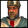 Richard

Przybli¿ony poziom trudnoœci: **80%**  
Typ lorda: **Europ**  
Si³a fizyczna: **140%**  
Cel ataku: **najbli¿szy przeciwnik**  

### Charakter

Richard jest bardzo silnym przeciwnikiem AI, który jest w stanie zbudowaæ zarówno siln¹ gospodarkê, groŸn¹ ofensywê jak i solidn¹ defensywê.
Jest to przeciwnik, który ma stanowiæ du¿e wyzwanie dla gracza i wymaga od niego przemyœlanej strategii oraz umiejêtnoœci zarz¹dzania zasobami.
Jego styl gry jest bardzo zrównowa¿ony, co sprawia, ¿e jest trudny do pokonania. Potrafi atakowaæ czêsto, a jednoczeœnie u¿ywany zestaw jednostek sprawia, ¿e jego ataki mog¹ byæ groŸne.

### Zamek

Buduje œredni zamek w kszta³cie kwadratu z kilkoma du¿ymi wie¿ami i du¿ymi bramami. Na wie¿ach umieszcza zarówno mangonele jak i balisty wie¿owe.
Wykorzystuje fosê oraz in¿ynierów z wrz¹cym olejem. Jego zamek jest trudny do prze³amania ze wzglêdu na kompaktow¹ konstrukcjê, ale nie jest tak trudny do prze³amania jak zamek Saladin czy Wolf.

### Gospodarka

Gospodarka Richard jest bardzo silna i ca³kiem zrównowa¿ona, co sprawia, ¿e odciêcie go od jakiegokolwiek Ÿród³a przychodu zwykle nie wystarcza do zahamowania jego przychodów.
Jego gospodarka opiera siê g³ównie na produkcji ¿ywnoœci, wydobyciu surowców, a tak¿e otrzymuje dodatkowe przychody za religiê.
Stosuje spor¹ liczbê rzeczy przyjemnych, które mo¿e i wp³ywaj¹ negatywnie na jego godspodarkê i przychody z niej, ale wp³ywaj¹ pozytywnie na morale jego wojska, co sprawia ¿e jego wojsko jest silne.

### Strategia bitewna

Richard to przeciwnik, którego zarówno obrona jak i atak s¹ potê¿ne i zrównowa¿one.
G³ównymi jednostkami Richard s¹ ³ucznicy, zbrojni, pikinierzy, a nawet rycerze. Zbrojni s¹ jego g³ówn¹ si³¹ ofensywn¹, pikinierzy s¹ znacz¹cym elementem jego defensywy a tak¿e s³u¿¹ do kopania fosy (zarówno swojej jak i wroga), a rycerze s¹ u¿ywani do nêkania gospodarki przeciwnika.
U¿ywa du¿ej iloœci ca³kiem zró¿nicowanych machin oblê¿niczych: trebuszy, katapult, taranów.
Jego ofensywa jest zró¿nicowana, ale ze wzglêdu na du¿¹ liczbê zbrojnych, poleca siê u¿ycie kuszników.
Jego rajdy mog¹ byæ uci¹¿liwe, ale ze wzglêdu na u¿ywanie rycerzy, poleca siê u¿ycie kuszników.
Jego defensywa jest bardzo trudna do prze³amania ze wzglêdu na kompaktow¹ konstrukcjê zamku, ale mo¿na j¹ prze³amaæ du¿¹ iloœci¹ katapult. Mo¿na te¿ u¿yæ pa³karzy do przekopania fosy.

##  Frederick

Przybli¿ony poziom trudnoœci: **90%**  
Typ lorda: **Europ**  
Si³a fizyczna: **120%**  
Cel ataku: **najbogatszy przeciwnik**  

### Charakter

Frederick jest bardzo silnym przeciwnikiem AI, który jest w stanie zbudowaæ zarówno siln¹ gospodarkê, groŸn¹ ofensywê jak i solidn¹ defensywê.
Jest to przeciwnik, który ma stanowiæ du¿e wyzwanie dla gracza i wymaga od niego przemyœlanej strategii oraz umiejêtnoœci zarz¹dzania zasobami.
Jego styl gry jest bardzo zrównowa¿ony, co sprawia, ¿e jest trudny do pokonania. Nie atakuje czêsto, ale jego ataki s¹ groŸne jeœli nie zostan¹ odpowiednio skontrowane.

### Zamek

Jego zamek nie przypomina prostego kszta³tu - jest to bardziej skomplikowana konstrukcja z kilkoma wie¿ami ró¿nych rozmiarów i ma³ymi bramami.
U¿ywa fosy, wilczych do³ów, in¿ynierów z wrz¹cym olejem, a tak¿e trebuszy (do niszczenia namiotów oblê¿niczych wroga).
Jego zamek ma kilka s³abych punktów, ale równie¿ kilka silnych punktów, co sprawia ¿e atakowanie go jest bardziej skomplikowane i wymaga wiêkszej strategii.

### Gospodarka

Gospodarka Frederick jest bardzo silna i zrównowa¿ona, co sprawia, ¿e odciêcie go od jakiegokolwiek Ÿród³a przychodu nie pogarsza znacz¹co jego sytuacji.
Jego gospodarka opiera siê g³ównie na wydobyciu surowców, a tak¿e otrzymuje dodatkowe przychody za religiê i funkcjonowanie karczm.
Stosuje niema³¹ liczbê rzeczy przyjemnych, które mo¿e i wp³ywaj¹ negatywnie na jego godspodarkê i przychody z niej, ale wp³ywaj¹ pozytywnie na morale jego wojska, co sprawia ¿e jego wojsko jest silne.

### Strategia bitewna

Frederick to przeciwnik, którego zarówno obrona jak i atak s¹ jednymi z najlepszych w grze.
G³ównymi jednostkami Frederick s¹ ³ucznicy, kusznicy, zbrojni, a nawet rycerze. Zbrojni s¹ jego g³ówn¹ si³¹ ofensywn¹, a rycerze s¹ u¿ywani do nêkania gospodarki przeciwnika.
U¿ywa du¿ej iloœci machin oblê¿niczych, ale s¹ to wy³¹cznie trebusze.
Jego ofensywa opiera siê na zbrojnych, którzy s¹ dodatkowo nieznacznie zmocnieni przez rzeczy przyjemne. Poleca siê u¿ycie kuszników do obrony.
Jego rajdy mog¹ byæ uci¹¿liwe, ale ze wzglêdu na u¿ywanie rycerzy, poleca siê u¿ycie kuszników.
Jego defensywa jest bardzo trudna do prze³amania, poniewa¿ opiera siê g³ównie na ³ucznikach i kusznikach, oferuj¹cych zbalansowany typ obra¿eñ. Najlepiej zaatakowaæ du¿¹ liczb¹ katapult wspieranych przez pa³karzy, pikinierów czy asasynów (aby efektywnie pozbyæ siê kuszników i ³uczników).

##  Phillip

Przybli¿ony poziom trudnoœci: **70%**  
Typ lorda: **Europ**  
Si³a fizyczna: **80%**  
Cel ataku: **najs³abszy przeciwnik**  

### Charakter

Phillip jest ca³kiem silnym przeciwnikiem AI, który s³ynie z jednej z najlepszych defensyw w grze.
Jest to przeciwnik, który ma stanowiæ œrednie wyzwanie dla gracza i wymaga od niego bardziej przemyœlanej strategii ni¿ prosty szturm na zamek.
Jego styl gry jest bardzo defensywny, co sprawia, ¿e jest trudny do pokonania. Jego ataki nie s¹ zbyt groŸne jeœli zostan¹ odpowiednio skontrowane.

### Zamek

Buduje spory i przede wszystkim szeroki zamek w kszta³cie prostok¹ta z kilkoma du¿ymi wie¿ami i du¿ymi bramami.
U¿ywa wilczych do³ów i sporej iloœci fosy. Jego zamek jest trudny do prze³amania ze wzglêdu na grube, wielowarstwowe mury a trudnoœæ jego prze³amania dorównuje zamkom Wolf i Saladin.
Podobnie jak w przypadku Saladin, jego zamek posiada silny front, ale s³ab¹ tyln¹ czêœæ, co sprawia, ¿e atakowanie go od ty³u jest jedyn¹ s³uszn¹ strategi¹, pod warunkiem, ¿e teren to umo¿liwia.

### Gospodarka

Gospodarka Phillip jest œrednio zrównowa¿ona, wiêc odciêcie go od jakiegokolwiek Ÿród³a przychodu mo¿e pogorszyæ jego sytuacjê.
Jego gospodarka opiera siê g³ównie na wydobyciu surowców, a tak¿e otrzymuje dodatkowe przychody za religiê.
Stosuje solidn¹ liczbê rzeczy przyjemnych, które mo¿e i wp³ywaj¹ negatywnie na jego godspodarkê i przychody z niej, ale wp³ywaj¹ pozytywnie na morale jego wojska, co sprawia ¿e jego wojsko jest silne, co dodatkowo wzmacnia jego defensywê.

### Strategia bitewna

Phillip to przeciwnik, którego obrona jest jedn¹ z najlepszych w grze. Nie atakuje bezmyœlnie, ale raczej zbiera jednostki i przeprowadza du¿e szturmy, które s¹ trudne do odparcia.
G³ównymi jednostkami Phillip s¹ ³ucznicy, pikinierzy, rycerze, a nawet mnisi. Piknierzy s¹ zarówno jego g³ówn¹ si³¹ ofensywn¹ jak i defensywn¹, a rycerze s¹ u¿ywani do nêkania gospodarki przeciwnika.
U¿ywa du¿ej iloœci machin oblê¿niczych ró¿nego rodzaju: trebuszy, katapult, wie¿ oblê¿niczych.
Jego ofensywa jest zró¿nicowana, ale ze wzglêdu na du¿¹ liczbê pikinierów, nie ma konkretnej kontry dystansowej - najskuteczniejszy jest ogieñ lub zatrzymanie ich swoimi pikinierami by jednostki dystansowe mia³y czas na ostrzelanie.
Jego rajdy mog¹ byæ uci¹¿liwe, ale ze wzglêdu na u¿ywanie rycerzy, poleca siê u¿ycie kuszników.
Jego defensywa jest bardzo trudna do prze³amania gdy atakujemy od frontu, ale s³aba z ty³u. Jeœli jednak nie ma mo¿liwoœci ataku od ty³u, to jego defensywa jest bardzo trudna do prze³amania i wymaga przemyœlanej strategii oraz sporej liczby jednostek. Mo¿na np.:
- u¿yæ pikinierów lub niewolników do przekopania fosy (najlepiej chroni¹c ich przenoœnymi tarczami), nastêpnie:
  - zniszczenie bramy taranami lub przejêcie jej asasynami
  - zdobycie murów wie¿ami oblê¿niczymi lub drabiniarzami

##  Wazir

Przybli¿ony poziom trudnoœci: **85%**  
Typ lorda: **Arab**  
Si³a fizyczna: **110%**  
Cel ataku: **najs³abszy przeciwnik**  

### Charakter

Wazir jest ca³kiem silnym przeciwnikiem AI, który s³ynie z mobilnego stylu gry.
Jest to przeciwnik, który ma stanowiæ spore wyzwanie dla gracza i wymaga od niego bardziej przemyœlanej strategii ni¿ prosty szturm na zamek.
Jego styl gry jest bardzo mobilny, co sprawia, ¿e jest trudny do pokonania. Jego ataki s¹ groŸne jeœli nie zostan¹ odpowiednio skontrowane.

### Zamek

Buduje du¿y zamek w kszta³cie piêcioramiennej gwiazdy z kilkoma wysokimi i du¿ymi wie¿ami i du¿ymi bramami. Na wie¿ach umieszcza zarówno mangonele jak i balisty wie¿owe.
U¿ywa fosy, wilczych do³ów, smolnych rowów, in¿ynierów z olejem, a tak¿e miotaczy ognia i balist ogniowych.
Jego zamek jest trudny do prze³amania ze wzglêdu na grube, wielowarstwowe mury ale fosa nie przylega bezpoœrednio do zamku, co sprawia, ¿e po przekopaniu fosy ³atwiej masowo niszczyæ mury zamku.

### Gospodarka

Gospodarka Wazir opiera siê g³ównie na produkcji ogromnej liczby ¿ywnoœci, wiêc zniszczenie jego farm jest kluczowe do os³abienia jego gospodarki.
Nie stosuje równie¿ ani rzeczy przyjemnych ani przygnêbiaj¹cych, co sprawia, ¿e jego styl gry jest bardziej zrównowa¿ony.
U¿ywa o jeden budynek uzdrowiciela wiêcej ni¿ wiêkszoœæ innych przeciwników AI, co sprawia, ¿e ataki powinny byæ silne a nie czêste, by nie daæ mu czasu na leczenie rannych jednostek.

### Strategia bitewna

Wazir to przeciwnik, którego zarówno obrona jak i atak s¹ zrównowa¿one, ale jego styl gry jest bardzo mobilny.
G³ównymi jednostkami Wazir s¹ konni ³ucznicy i zbrojni. Konni ³ucznicy s¹ jego g³ówn¹ si³¹ ofensywn¹, a tak¿e s¹ u¿ywani do nêkania gospodarki przeciwnika.
U¿ywa du¿ej iloœci machin oblê¿niczych, ale s¹ to wy³¹cznie trebusze i balisty ogniowe.
Jego ofensywa jest zró¿nicowana, ale ze wzglêdu na du¿¹ liczbê konnych ³uczników, poleca siê u¿ycie tanich ³uczników lub rycerzy (s¹ jedn¹ z nielicznych wystarczaj¹co szybkich jednostek by dogoniæ konnych ³uczników), ewentualnie w³óczników, ale wymaga to przemyœlanego zastosowania.
Jego rajdy mog¹ byæ uci¹¿liwe, ale ze wzglêdu na u¿ywanie konnych ³uczników, poleca siê u¿ycie rycerzy lub w³óczników.
Jego defensywa nie jest szczególnie problematyczna jeœli atak jest solidny.

##  Emir

Przybli¿ony poziom trudnoœci: **75%**  
Typ lorda: **Arab**  
Si³a fizyczna: **100%**  
Cel ataku: **najbogatszy przeciwnik**  

### Charakter

Emir jest solidnym przeciwnikiem AI o zbalansowanym stylu gry.
Jest to przeciwnik, który ma stanowiæ œrednie wyzwanie dla gracza i wymaga od niego przemyœlanej strategii oraz umiejêtnoœci zarz¹dzania zasobami.
Jego styl gry jest zrównowa¿ony, co sprawia, ¿e jest trudny do pokonania. Jego ataki s¹ pomiêdzy czêstymi a solidnymi, co sprawia, ¿e gracz musi byæ gotowy na obronê.

### Zamek

Jego zamki przypominaj¹ kwadrat z grubymi, wielowarstwowymi murami i kilkoma du¿ymi wie¿ami i du¿¹ bram¹. Zamek jest z kolei dodatkowo otoczony kolejnymi murami w kszta³cie ko³a z wieloma wysokimi wie¿ami i kilkoma ma³ymi bramami.
Jedyny rodzaj pu³apek, które Emir stosuje to wilcze do³y i in¿ynierowie z wrz¹cym olejem. Brak fosy sprawia, ¿e jego zamek jest nienajtrudniejszy do prze³amania.

### Gospodarka

Gospodarka Emir jest zrównowa¿ona, a jego przychody s¹ wystarczaj¹ce do produkcji du¿ej liczby jednostek.
Jego gospodarka opiera siê g³ównie na produkcji ¿ywnoœci oraz wydobyciu surowców.
Stosuje nienajgorsz¹ liczbê rzeczy przyjemnych, które mo¿e i wp³ywaj¹ negatywnie na jego godspodarkê i przychody z niej, ale wp³ywaj¹ pozytywnie na morale jego wojska, co sprawia ¿e jego wojsko jest silne.

### Strategia bitewna

Emir to przeciwnik, którego obrona pozornie jest dobra, ale przy odpowiedniej strategii mo¿na ³atwo dostaæ siê do jego zamku.
G³ównymi jednostkami Emir s¹ arabscy ³ucznicy i arabscy zbrojni, ale jest to przeciwnik, który dodatkowo korzysta z jednostek europejskich jak ³ucznicy i pa³karze. Arabscy zbrojni s¹ jego g³ówn¹ si³¹ ofensywn¹, a pa³karze s¹ u¿ywani do nêkania gospodarki przeciwnika.
U¿ywa du¿ej iloœci machin oblê¿niczych, ale s¹ to wy³¹cznie katapulty.
Jego ofensywa jest zró¿nicowana, ale ze wzglêdu na du¿¹ liczbê arabskich zbrojnych, poleca siê u¿ycie kuszników.
Jego rajdy mog¹ byæ uci¹¿liwe, ale ze wzglêdu na u¿ywanie pa³karzy, poleca siê u¿ycie kuszników.
Jego defensywa jest podatna na u¿ycie wie¿ oblê¿niczych lub drabiniarzy, dziêki którym mo¿na ³atwo w³amaæ siê do jego wewnêtrznego zamku. Ewentualnie mo¿na wykorzystaæ inne machiny oblê¿nicze do zniszczenia jego wie¿, by zredukowaæ liczbê jednostek dystansowych.

##  Nizar

Przybli¿ony poziom trudnoœci: **45%**  
Typ lorda: **Arab**  
Si³a fizyczna: **130%**  
Cel ataku: **najbli¿szy przeciwnik**  

### Charakter

Nizar jest przeciwnikiem AI, który s³ynie z u¿ywania asasynów i niespodziewanych ataków.
Jest to przeciwnik, który ma stanowiæ œrednie wyzwanie dla gracza i wymaga od niego przemyœlanej strategii oraz umiejêtnoœci zarz¹dzania zasobami.
Jego styl gry jest bardzo agresywny, co sprawia, ¿e jest trudny do pokonania. Jego ataki s¹ czêste i niespodziewane, co sprawia, ¿e gracz musi byæ gotowy na obronê.

### Zamek

Nizar buduje œredni zamek w kszta³cie rombu z kilkoma du¿ymi wie¿ami i ma³ymi bramami. Obsadza wie¿e balistami ogniowymi.
U¿ywa fosy, wilczych do³ów, smolnych rowów, in¿ynierów z wrz¹cym olejem, a tak¿e balist ogniowych.

### Gospodarka

Gospodarka Nizar jest solidna, co sprawia, ¿e odciêcie go od jakiegokolwiek Ÿród³a przychodu nie pogarsza znacz¹co jego sytuacji.
Jego gospodarka opiera siê g³ównie na produkcji ¿ywnoœci, wydobyciu surowców, a tak¿e otrzymuje dodatkowe przychody za funkcjonowanie karczm.
Stosuje bardzo du¿¹ liczbê rzeczy przyjemnych, które mo¿e i wp³ywaj¹ negatywnie na jego godspodarkê i przychody z niej, ale wp³ywaj¹ pozytywnie na morale jego wojska, co sprawia ¿e jego wojsko jest silne, szczególnie ofensywnie.

### Strategia bitewna

Nizar to przeciwnik, którego obrona jest solidna, ale jego ataki s¹ bardzo agresywne i niespodziewane.
G³ównymi jednostkami Nizar s¹ asasyni i arabscy ³ucznicy. Asasyni s¹ jego g³ówn¹ si³¹ zarówno ofensywn¹ jak i do rajdów, a arabscy ³ucznicy s¹ u¿ywani tylko do obrony.
Jako jedyny wœród domyœlnych przeciwników AI, Nizar nie u¿ywa machin oblê¿niczych (jedynie harasuj¹ce), ale zamiast tego korzysta z asasynów, którymi mo¿e wspinaæ siê na mury zamku by dostaæ siê do lorda.
Jego ofensywa opiera siê tylko na asasynach, którzy s¹ dodatkowo zmocnieni przez rzeczy przyjemne. Najbardziej oczywist¹ kontr¹ jest posiadanie fosy, która uniemo¿liwia mu dojœcie do murów zamku.
Jego rajdy mog¹ byæ uci¹¿liwe, ale ze wzglêdu na u¿ywanie asasynów, poleca siê zabezpieczenie wa¿niejszych budynków klatami psów wojennych i stacjonowanie tam jednostek ciê¿ko opancerzonych.
Jego defensywa jest solidna, ale ze wzglêdu na u¿ywanie asasynów, czêsto wystarczy szturmowanie jednostkami ciê¿ko opancerzonymi, i utorowanie sobie drogi przez smolne rowy tanimi i szybkimi jednostkami.

##  Sheriff

Przybli¿ony poziom trudnoœci: **65%**  
Typ lorda: **Europ**  
Si³a fizyczna: **110%**  
Cel ataku: **najbli¿szy przeciwnik**  

### Charakter

Sheriff jest œrednio silnym przeciwnikiem AI o zbalansowanym, ale lekko przebieg³ym stylu gry.
Jest to przeciwnik, który ma stanowiæ œrednie wyzwanie dla gracza i wymaga od niego przemyœlanej strategii oraz umiejêtnoœci zarz¹dzania zasobami.
Jego styl gry jest zrównowa¿ony, ale jego ataki s¹ przebieg³e i niespodziewane, co sprawia, ¿e jest trudny do pokonania. Jego ataki s¹ czêste i niespodziewane, co sprawia, ¿e gracz musi byæ gotowy na obronê.

### Zamek

Buduje ma³y zamek w kszta³cie prostok¹ta z kilkoma du¿ymi wie¿ami obsadzonymi balistami wie¿owymi. Do zamku przylegaj¹ z ty³u mury w kszta³cie elipsy, które zawieraj¹ jego budynki gospodarcze.
U¿ywa wilczych do³ów, smolnych rowów, klatek z psami wojennymi, miotaczy ognia, a tak¿e balist ogniowych.

### Gospodarka

Gospodarka Sheriff jest solidna, co sprawia, ¿e odciêcie go od jakiegokolwiek Ÿród³a przychodu nie pogarsza znacz¹co jego sytuacji.
Jego gospodarka opiera siê g³ównie na wydobyciu surowców, a tak¿e otrzymuje dodatkowe przychody za religiê i funkcjonowanie karczm.
Stosuje solidn¹ liczbê rzeczy przygnêbiaj¹cych, które dodatkowo wzmacniaj¹ jego gospodarkê i przychody z niej, i choæ wp³ywa to negatywnie na morale jego wojska, to pozwala mu na czêstsze ataki.

### Strategia bitewna

Sheriff to przeciwnik, którego obrona jest solidna, ale jego ataki s¹ przebieg³e i niespodziewane.
G³ównymi jednostkami Sheriff s¹ kusznicy i pikinierzy, ale jest to przeciwnik, który dodatkowo korzysta z jednostek arabskich jak asasyni i miotacze ognia. Pikinierzy s¹ jego g³ówn¹ si³¹ defensywn¹, a asasyni s¹ u¿ywani do nêkania gospodarki przeciwnika.
U¿ywa du¿ej iloœci machin oblê¿niczych, ale s¹ to wy³¹cznie katapulty i balisty ogniowe.
Jego ofensywa jest zró¿nicowana, ale ze wzglêdu na du¿¹ liczbê pikinierów, nie ma konkretnej kontry dystansowej - najskuteczniejszy jest ogieñ lub zatrzymanie ich swoimi pikinierami by jednostki dystansowe mia³y czas na ostrzelanie.
Jego rajdy mog¹ byæ uci¹¿liwe, ale ze wzglêdu na u¿ywanie asasynów, poleca siê zabezpieczenie wa¿niejszych budynków klatami psów wojennych i stacjonowanie tam jednostek ciê¿ko opancerzonych.
Jego defensywa jest solidna, ale ze wzglêdu na u¿ywanie kuszników i pikinierów, dobrym pomys³em mo¿e byæ u¿ycie pa³karzy lub pikinierów w po³¹czeniu z wie¿¹ oblê¿nicz¹ lub drabiniarzem, by dostaæ siê do jego zamku i przeprowadziæ bezpoœredni atak na lorda.

##  Marshal

Przybli¿ony poziom trudnoœci: **50%**  
Typ lorda: **Europ**  
Si³a fizyczna: **110%**  
Cel ataku: **najs³abszy przeciwnik**  

### Charakter

Marshal jest przeciwnikiem AI, który s³ynie z u¿ywania najwiêkszej liczby rycerzy.
Jest to przeciwnik, który ma stanowiæ œrednie wyzwanie dla gracza i wymaga od niego przemyœlanej strategii oraz umiejêtnoœci zarz¹dzania zasobami.
Jego styl gry jest bardzo agresywny, co sprawia, ¿e jest trudny do pokonania. Jego ataki s¹ czêste i wymierzone w niszczenie gospodarki.

### Zamek

Buduje œredni zamek kszta³tem przypominaj¹cy literê H z kilkoma œrednimi wie¿ami i ma³ymi bramami.
U¿ywa fosy, wilczych do³ów, a tak¿e trebuszy (do niszczenia namiotów oblê¿niczych wroga).
Odrobinê s³abszym punktem jego zamku s¹ ty³y, które nie s¹ tak dobrze zabezpieczone jak front, ale nadal s¹ trudne do prze³amania.

### Gospodarka

Gospodarka Marshal jest nienajgorsza - odciêcie go od jakiegokolwiek Ÿród³a przychodu mo¿e pogorszyæ jego sytuacjê.
Jego gospodarka opiera siê g³ównie na wydobyciu surowców (szczególnie ¿elaza), a tak¿e otrzymuje dodatkowe przychody za funkcjonowanie karczm.
Nie ma ¿adnych specjalnych budynków ani technologii, które by zwiêksza³y jego przychody z wyj¹tkiem kilku rzeczy przyjemnych, które jednak nie maj¹ wiêkszego wp³ywu na jego grê.

### Strategia bitewna

Marshal to przeciwnik, którego obrona jest przeciêtna a g³ówna si³a to rajdy przeprowadzane przez rycerzy.
G³ównymi jednostkami Marshal s¹ rycerze, ³ucznicy, w³ócznicy i zbrojni. Zbrojni s¹ jego g³ówn¹ si³¹ ofensywn¹, w³ócznicy s¹ u¿ywani do kopania fosy, a rycerze s¹ u¿ywani do nêkania gospodarki przeciwnika.
U¿ywa przeciêtnej iloœci machin oblê¿niczych, ale s¹ to wy³¹cznie katapulty i trebusze.
Jego ofensywa jest zró¿nicowana, ale ze wzglêdu na du¿¹ liczbê zbrojnych, poleca siê u¿ycie kuszników.
Jego rajdy mog¹ byæ uci¹¿liwe, ale ze wzglêdu na u¿ywanie rycerzy, poleca siê u¿ycie kuszników lub pikinierów.
Jego defensywa jest przeciêtna, ale ze wzglêdu na u¿ywanie zbrojnych i w³óczników, nienajgorsze pomys³y to:
- atak du¿¹ iloœci¹ procarzy ze wzglêdu na relatywnie du¿¹ skutecznoœæ przeciwko ka¿dej z jego jednostek
- atak du¿¹ iloœci¹ kuszników wspieranych przez pikinierów, by zniszczyæ w³óczników i zbrojnych
- szybkie przekopanie fosy na przodzie i odwrócenie uwagi przeciwnika, by przeprowadziæ atak asasynami na lorda

##  Abbot

Przybli¿ony poziom trudnoœci: **40%**  
Typ lorda: **Europ**  
Si³a fizyczna: **120%**  
Cel ataku: **najbogatszy przeciwnik**  

### Charakter

Abbot jest przeciwnikiem AI, który s³ynie z u¿ywania mnichów, o silnej gospodarcie ale relatywnie s³abej defensywie i ofensywie.
Jest to przeciwnik, który nie ma stanowiæ du¿ego wyzwania dla gracza i nie wymaga od niego skomplikowanych taktyk.
Dziêki dobrej gospodarce, jego ataki s¹ czêste, ale nie s¹ zbyt groŸne.

### Zamek

Jego zamek jest œredni i przypomina kszta³tem krzy¿, ze spor¹ iloœci¹ ma³ych wie¿ i kilkoma du¿ymi bramami.
U¿ywa fosy, wilczych do³ów, smolnych rowów, in¿ynierów z wrz¹cym olejem, a tak¿e balist ogniowych.
Jego zamek jest trudny do prze³amania ze wzglêdu na grube, wielowarstwowe mury, ale jest wra¿liwy na zajêcie murów wie¿ami oblê¿niczymi lub drabiniarzami, co pozwala dostaæ siê do wnêtrza zamku.

### Gospodarka

Gospodarka Abbot jest bardzo silna i zrównowa¿ona, co sprawia, ¿e odciêcie go od jakiegokolwiek Ÿród³a przychodu nie pogarsza znacz¹co jego sytuacji.
Jego gospodarka opiera siê g³ównie na produkcji ¿ywnoœci, a tak¿e otrzymuje dodatkowe przychody za religiê.
Stosuje solidn¹ liczbê rzeczy przyjemnych, które mo¿e i wp³ywaj¹ negatywnie na jego godspodarkê i przychody z niej, ale wp³ywaj¹ pozytywnie na morale jego wojska, co sprawia ¿e jego wojsko jest silne.

### Strategia bitewna

Abbot to przeciwnik, którego obrona nie jest zbyt silna, ale jego ataki s¹ czêste i niespodziewane.
G³ównymi jednostkami Abbot s¹ mnisi, ³ucznicy i zbrojni. Mnisi s¹ jego g³ówn¹ si³¹ zarówno ofensywn¹ jak i defensywn¹, a tak¿e s¹ u¿ywani do nêkania gospodarki przeciwnika (choæ jest to zwykle nieskuteczne).
U¿ywa niedu¿ej iloœci machin oblê¿niczych, ale s¹ one ró¿norodne: balisty ogniowe, katapulty, tarany.
Jego ofensywa sk³ada siê g³ównie z mnichów, którzy s¹ dodatkowo zmocnieni przez rzeczy przyjemne. Poleca siê u¿ycie ³uczników do obrony przeciwko mnichom, oraz kuszników do obrony przeciwko zbrojnym, ale najlepszym zabezpieczeniem jest posiadanie fosy, która uniemo¿liwia mu dojœcie do murów zamku.
Jego rajdy s¹ s³abe i ze wzglêdu na u¿ywanie mnichów, wystarczy niedu¿y oddzia³ ³uczników by je odeprzeæ.
Jego defensywa sk³adaj¹ca siê g³ównie z ³uczników jest nietrudna do prze³amania tym samym typem jednostek.

##  Arslan

Przybli¿ony poziom trudnoœci: **65%**  
Typ lorda: **Arab**  
Si³a fizyczna: **130%**  
Cel ataku: **najbogatszy przeciwnik**  

### Charakter

Arslan jest œrednio silnym przeciwnikiem AI o mobilnym stylu gry.
Jest to przeciwnik, który ma stanowiæ œrednie wyzwanie dla gracza i wymaga od niego przemyœlanej strategii oraz umiejêtnoœci zarz¹dzania zasobami.

### Zamek

Jego zamek jest œredni i przypomina kszta³em literê X, z kilkoma du¿ymi i wysokimi wie¿ami. Na wie¿ach umieszcza balisty wie¿owe.
U¿ywa fosy, smolnych rowów, in¿ynierów z wrz¹cym olejem, a tak¿e miotaczy ognia i balist ogniowych.
Jego zamek nie jest trudny do prze³amania - od jego centrum wij¹ siê mury we wszystkie strony na koñcu których stoi po jednej wie¿y, co pomaga mu chroniæ farmy i budynki wydobywcze, ale minusem jest podatnoœæ na zajêcie murów wie¿ami oblê¿niczymi lub drabiniarzami, co pozwala dostaæ siê do wnêtrza zamku.

### Gospodarka

Gospodarka Arslan jest bardzo silna, ale opiera siê o wydobycie surowców i produkcjê ¿ywnoœci, wiêc ³atwo j¹ os³abiæ poprzez zniszczenie farm i kopalni.
Stosuje znikom¹ liczbê rzeczy przyjemnych, co nie ma wiêkszego wp³ywu na jego grê.

### Strategia bitewna

Arslan to przeciwnik, którego obrona nie jest zbyt silna, ale jego ataki s¹ mobilne i przebieg³e.
G³ównymi jednostkami Arslan s¹ konni ³ucznicy i asasyni.
Jego ofensywa sk³ada siê g³ównie z konnych ³uczników i asasynów. Poleca siê u¿ycie ³uczników do obrony dystansowej i pikinierów przeciwko obu typom jednostek.
Jego rajdy mog¹ byæ uci¹¿liwe, ale ze wzglêdu na u¿ywanie asasynów, poleca siê zabezpieczenie wa¿niejszych budynków klatami psów wojennych i stacjonowanie tam jednostek ciê¿ko opancerzonych.
Jego defensywa sk³ada siê g³ównie z arabskich ³uczników i miotaczy ognia, co sprawia, ¿e relatywnie op³acalni przeciwko nim s¹ procarze lub ³ucznicy.

##  Baibars

Przybli¿ony poziom trudnoœci: **100%**  
Typ lorda: **Arab**  
Si³a fizyczna: **150%**  
Cel ataku: **najs³abszy przeciwnik**  

### Charakter

...

### Zamek

...

### Gospodarka

...

### Strategia bitewna

...

##  Baldwin

Przybli¿ony poziom trudnoœci: **95%**  
Typ lorda: **Europ**  
Si³a fizyczna: **70%**  
Cel ataku: **najbli¿szy przeciwnik**  

### Charakter

...

### Zamek

...

### Gospodarka

...

### Strategia bitewna

...

##  Bohemond

Przybli¿ony poziom trudnoœci: **75%**  
Typ lorda: **Europ**  
Si³a fizyczna: **140%**  
Cel ataku: **najs³abszy przeciwnik**  

### Charakter

...

### Zamek

...

### Gospodarka

...

### Strategia bitewna

...

##  Hugh

Przybli¿ony poziom trudnoœci: **45%**  
Typ lorda: **Europ**  
Si³a fizyczna: **80%**  
Cel ataku: **najbli¿szy przeciwnik**  

### Charakter

...

### Zamek

...

### Gospodarka

...

### Strategia bitewna

...

##  Kahin

Przybli¿ony poziom trudnoœci: **40%**  
Typ lorda: **Arab**  
Si³a fizyczna: **90%**  
Cel ataku: **najs³abszy przeciwnik**  

### Charakter

...

### Zamek

...

### Gospodarka

...

### Strategia bitewna

...

##  Manuel

Przybli¿ony poziom trudnoœci: **80%**  
Typ lorda: **Europ**  
Si³a fizyczna: **120%**  
Cel ataku: **najbogatszy przeciwnik**  

### Charakter

...

### Zamek

...

### Gospodarka

...

### Strategia bitewna

...

##  Melisende

Przybli¿ony poziom trudnoœci: **60%**  
Typ lorda: **Europ**  
Si³a fizyczna: **100%**  
Cel ataku: **najs³abszy przeciwnik**  

### Charakter

...

### Zamek

...

### Gospodarka

...

### Strategia bitewna

...

##  Nomad

Przybli¿ony poziom trudnoœci: **30%**  
Typ lorda: **Arab**  
Si³a fizyczna: **120%**  
Cel ataku: **najbli¿szy przeciwnik**  

### Charakter

...

### Zamek

...

### Gospodarka

...

### Strategia bitewna

...

##  Reynald

Przybli¿ony poziom trudnoœci: **70%**  
Typ lorda: **Europ**  
Si³a fizyczna: **120%**  
Cel ataku: **najbogatszy przeciwnik**  

### Charakter

...

### Zamek

...

### Gospodarka

...

### Strategia bitewna

...

##  Rogue

Przybli¿ony poziom trudnoœci: **40%**  
Typ lorda: **Europ**  
Si³a fizyczna: **110%**  
Cel ataku: **najbogatszy przeciwnik**  

### Charakter

...

### Zamek

...

### Gospodarka

...

### Strategia bitewna

...

## 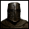 Sentinel

Przybli¿ony poziom trudnoœci: **50%**  
Typ lorda: **Europ**  
Si³a fizyczna: **130%**  
Cel ataku: **najbli¿szy przeciwnik**  

### Charakter

...

### Zamek

...

### Gospodarka

...

### Strategia bitewna

...

##  Shajar

Przybli¿ony poziom trudnoœci: **55%**  
Typ lorda: **Arab**  
Si³a fizyczna: **100%**  
Cel ataku: **najbogatszy przeciwnik**  

### Charakter

...

### Zamek

...

### Gospodarka

...

### Strategia bitewna

...

## 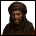 Slavemaster

Przybli¿ony poziom trudnoœci: **25%**  
Typ lorda: **Arab**  
Si³a fizyczna: **50%**  
Cel ataku: **gracz**  

### Charakter

...

### Zamek

...

### Gospodarka

...

### Strategia bitewna

...

##  Tamar

Przybli¿ony poziom trudnoœci: **90%**  
Typ lorda: **Europ**  
Si³a fizyczna: **110%**  
Cel ataku: **najbli¿szy przeciwnik**  

### Charakter

...

### Zamek

...

### Gospodarka

...

### Strategia bitewna

...

##  Zengi

Przybli¿ony poziom trudnoœci: **85%**  
Typ lorda: **Arab**  
Si³a fizyczna: **130%**  
Cel ataku: **najs³abszy przeciwnik**  

### Charakter

...

### Zamek

...

### Gospodarka

...

### Strategia bitewna

...

# Zmiany w potyczkach

## Ustawienia startowe

(zmiany w poziomach trudnoœci i trybach gry, startowe zasoby i z³oto)
W grze jest 5 poziomów trudnoœci, ale pierwsze s¹ zbyt ³atwe, wiêc w praktyce gra siê na poziomie 3 lub wy¿ej.
W grze s¹ 3 tryby potyczek: normalny, krucjata, deathmatch - ale s¹ one zbyt podobne do siebie, wiêc czêsto gra siê tylko na normalnym.
Startowe zasoby i z³oto s¹ zbyt du¿e, co sprawia, ¿e gra jest zbyt ³atwa i nie wymaga strategii. Gracz jest w stanie szybko zbudowaæ gospodarkê i siln¹ defensywê, zanim przeciwnik AI zd¹¿y go zaatakowaæ, co sprawia, ¿e gracz nie czuje presji i nie musi podejmowaæ trudnych decyzji.
Dlatego wprowadzono nastêpuj¹ce zmiany:
- Poziomy trudnoœci zosta³y przesuniête o 2 w górê , co sprawia, ¿e np. poziom 1 jest teraz podobny do wczeœniejszego poziomu 3.
- Startowe zasoby i z³oto zosta³y zmniejszone, co sprawia, ¿e gra jest trudniejsza i wymaga wiêkszej strategii. Gracz musi teraz bardziej uwa¿aæ na swoje decyzje i trudniej jest zbudowaæ siln¹ gospodarkê i defensywê, zanim przeciwnik AI zd¹¿y go zaatakowaæ.
- Tryby potyczek zosta³y zmienione, by by³y bardziej zró¿nicowane i unikalne:
  - Normalny: za³o¿enia s¹ podobne do oryginalnej gry, ale z wiêkszymi wymaganiami co do strategii i zarz¹dzania zasobami.
  - Krucjata: by³ zbyt podobny do normalnego, z jedyn¹ ró¿nic¹ wiêkszej iloœci jednostek na starcie, wiêc dla wyró¿nienia wprowadzono dodatkow¹ zmianê - mniej drewna i wiêcej kamienia na starcie, co sprawia, ¿e gra jest bardziej zró¿nicowana i wymaga innej strategii np. kontroli mapy i zdobywania surowców zamiast spokojnego budowania gospodarki.
  - Deathmatch: w tym trybie startowe zasoby i z³oto s¹ bardzo du¿e, co zosta³o dodatkowo podkreœlone w zmianach np. przeciwnicy AI maj¹ jeszcze wiêcej z³ota na starcie. Startowych zasobów jest teraz mniej, ale nadal wystarczaj¹co du¿o, by zbudowaæ siln¹ gospodarkê i defensywê.
- Niezale¿nie od wybranego trybu potyczek, przeciwnicy AI maj¹ dwukrotnie wiêcej jednostek startowych, co dodatkowo zabezpiecza misje przed szybkim wyelimiowaniem przeciwnika asasynami lub mnichami na samym pocz¹tku misji.

## Opcje posterunków

Posterunki w oryginalnej grze oferuj¹ za ma³o zakres jednostek do spawnowania, co sprawia, ¿e misje z ich u¿yciem s¹ bardzo powtarzalne.
Niektóre opcje jednostek s¹ bez sensu np. posterunek europejski ma a¿ 3 z 8 opcji do spawnu katapult, które zreszt¹ nie dzia³aj¹ prawid³owo i strzelaj¹ dopiero po dojœciu do budynku.
Dodatkowo liczba spawnowanych katapult jest zbyt du¿a, co sprawia, ¿e trudno je zniszczyæ w póŸniejszej fazie gry gdy spawn przyspiesza.
Dodatkowo brakuje niektórych jednostek, które s¹ g³ówn¹ si³¹ danego przeciwnika AI, np. mnisi w przypadku Opata, czy asasyni w przypadku Nizara.
Dlatego wprowadzono nastêpuj¹ce zmiany:
- W posterunku europejskim wymieniono 3 opcje spawnu katapult na spawn: kuszników, pikinierów, mnichów.
- W posterunku arabskim wymieniono 1 opcjê spawnu katapult na spawn asasynów.
- Przygotowano 3 zestawy konfiguracji posterunków:
  - Pierwszy zestaw ma iloœci spawnowanych jednostek mniejsze, dostosowane do gry singleplayer, gdzie pojedynczy gracz mia³by problemy z odpieraniem ataków wiêkszej liczby jednostek. Zak³adamy, ¿e opcja mocy Extreme jest wy³¹czona.
  - Drugi zestaw ma iloœci spawnowanych jednostek wiêksze, dostosowane do gry w trybie kooperacji, gdzie gracze mog¹ siê wspieraæ i odpieraæ ataki wiêkszej liczby jednostek. Zak³adamy, ¿e opcja mocy Extreme jest wy³¹czona.
  - Trzeci zestaw ma iloœci spawnowanych jednostek jeszcze wiêksze, dostosowane do gry multiplayer, gdzie w za³o¿eniu gracze a nie tylko przeciwnicy AI maj¹ do nich dostêp. Zak³adamy, ¿e nie ma znaczenia czy opcja mocy Extreme jest w³¹czona.
  - Zmieniony szlak potyczek by³ projektowany z myœl¹ o pierwszym zestawie, ale mapy s¹ projektowane w taki sposób, ¿e wystarczy do³o¿yæ drugiego gracza i zmieniæ na drugi zestaw, by osi¹gn¹æ relatywnie zbalansowan¹ grê w trybie kooperacji.

## Zmiany w szlaku potyczek

Poni¿ej znajduj¹ siê opisy zmian w g³ównym szlaku potyczego (50 misji potyczek z przeciwnikami AI). Opisy obejmuj¹ nowe mapy, zmiany przeciwników w niektórych misjach, startowe zasoby itp.

### Misja 1
Tryb gry i startowy poziom surowców: **Normal 2**  
Matchup: **Player vs Sultan**  
Jednostki z posterunków: **Slinger**  
Dostêpne dla gracza surowce: **drzewa, tereny zielone, z³o¿a kamienia, z³o¿a ¿elaza**  
Inne cechy:
- du¿a odleg³oœæ od wroga
- sporo niedostêpnych terenów (woda)
- wróg ma zabezpieczon¹ gospodarkê

### Misja 2
Tryb gry i startowy poziom surowców: **Normal 3**  
Matchup: **Player vs Caliph**  
Jednostki z posterunków: **Slaver**  
Dostêpne dla gracza surowce: **drzewa, tereny zielone, z³o¿a kamienia, z³o¿a ¿elaza, z³o¿a ropy**  
Inne cechy:
- du¿a odleg³oœæ od wroga
- du¿a odleg³oœæ od z³ó¿ kamienia i ¿elaza (nara¿enie na atak wroga)
- relatywnie otwarty teren
- kilka w¹skich przejœæ przez œrodek mapy

### Misja 3
Tryb gry i startowy poziom surowców: **Deathmatch 3**  
Matchup: **Player, Richard vs Sheriff, Sheriff**  
Jednostki z posterunków: **Pikeman**  
Dostêpne dla gracza surowce: **drzewa, tereny zielone, z³o¿a kamienia, z³o¿a ¿elaza, z³o¿a ropy**  
Inne cechy:
- du¿a odleg³oœæ od wroga
- du¿a odleg³oœæ od sojuszników
- kilka w¹skich przejœæ przez rzeki do wroga
- Richard jest pod ci¹g³ym atakiem wrogów, wiêc gracz powinien mu pomóc

### Misja 4
Tryb gry i startowy poziom surowców: **Normal 4**  
Matchup: **Player vs Pig**  
Jednostki z posterunków: **Maceman**  
Dostêpne dla gracza surowce: **drzewa, tereny zielone, z³o¿a kamienia (po odblokowaniu), z³o¿a ¿elaza (po odblokowaniu)**  
Inne cechy:
- du¿a odleg³oœæ od wroga
- sporo niedostêpnych terenów (fosa)
- potrzeba przekopania fosy by dostaæ siê do z³ó¿ kamienia i ¿elaza
- w¹ska droga przez œrodek mapy z mo¿liwoœci¹ odblokowania drogi przez krawêdzie mapy

### Misja 5
Tryb gry i startowy poziom surowców: **Deathmatch 2**  
Matchup: **Player, Marshal vs Wolf**  
Jednostki z posterunków: **EuropArcher, Maceman, Crossbowman, Pikeman, Swordsman**  
Dostêpne dla gracza surowce: **drzewa, z³o¿a kamienia, z³o¿a ¿elaza, z³o¿a ropy**  
Inne cechy:
- du¿a odleg³oœæ od wroga
- du¿a odleg³oœæ od sojuszników
- du¿a odleg³oœæ od z³ó¿ ¿elaza i ropy
- wróg ma zabezpieczon¹ gospodarkê
- Marshal jest pod ci¹g³ym atakiem wroga, wiêc gracz powinien mu pomóc

### Misja 6
Tryb gry i startowy poziom surowców: **Normal 2**  
Matchup: **Player vs Snake, Snake, Snake**  
Jednostki z posterunków: **EuropArcher, Spearman**  
Dostêpne dla gracza surowce: **drzewa, tereny zielone, z³o¿a ropy**  
Inne cechy:
- siedziba na œrodku mapy w relatywnie otwartym terenie
- du¿a odleg³oœæ od z³ó¿ kamienia i ¿elaza (nara¿enie na atak wroga)
- wróg ma zabezpieczon¹ gospodarkê

### Misja 7
Tryb gry i startowy poziom surowców: **Normal 4**  
Matchup: **Player vs Abbot, Abbot**  
Jednostki z posterunków: **EuropArcher, Monk**  
Dostêpne dla gracza surowce: **drzewa, tereny zielone, z³o¿a kamienia, z³o¿a ¿elaza**  
Inne cechy:
- du¿a odleg³oœæ od wroga
- du¿a odleg³oœæ od sojuszników
- wróg ma zabezpieczon¹ gospodarkê
- du¿a odleg³oœæ od terenów zielonych i z³ó¿ ropy (nara¿enie na atak wroga)

### Misja 8
Tryb gry i startowy poziom surowców: **Normal 2**  
Matchup: **Player vs Rat, Rat, Rat, Rat**  
Jednostki z posterunków: **Spearman**  
Dostêpne dla gracza surowce: **drzewa, tereny zielone, z³o¿a ¿elaza**  
Inne cechy:
- du¿a odleg³oœæ od wroga
- wróg ma zabezpieczon¹ gospodarkê
- du¿a odleg³oœæ od z³ó¿ kamienia i ropy (nara¿enie na atak wroga)
- w¹ska droga przez labirynt i wymuszona kolejnoœæ pokonywania wrogów

### Misja 9
Tryb gry i startowy poziom surowców: **Normal 3**  
Matchup: **Player vs Saladin**  
Jednostki z posterunków: **ArabArcher**  
Dostêpne dla gracza surowce: **drzewa, tereny zielone, z³o¿a kamienia, z³o¿a ¿elaza, z³o¿a ropy**  
Inne cechy:
- du¿a odleg³oœæ od wroga
- du¿a odleg³oœæ od z³ó¿ kamienia i ¿elaza (nara¿enie na atak wroga)
- wróg ma zabezpieczon¹ gospodarkê
- sporo niedostêpnych terenów (woda)
- relatywnie otwarty teren

### Misja 10
Tryb gry i startowy poziom surowców: **Deathmatch 3**  
Matchup: **Player, Rat vs Saladin, Sultan**  
Jednostki z posterunków: **ArabArcher, Slinger, ArabSwordsman**  
Dostêpne dla gracza surowce: **drzewa, tereny zielone, z³o¿a kamienia, z³o¿a ¿elaza, z³o¿a ropy**  
Inne cechy:
- du¿a odleg³oœæ od wroga
- du¿a odleg³oœæ od terenów zielonych, z³ó¿ kamienia i ¿elaza (nara¿enie na atak wroga)
- startowe z³o¿a s¹ niewystarczaj¹ce do zbudowania silnej gospodarki, wiêc gracz musi walczyæ wywalczyæ sobie wiêcej surowców
- wiêcej bezpiecznych Ÿróde³ surowców (drewno, tereny zielone, z³o¿a ¿elaza) mo¿na odblokowaæ poprzez przekopanie fosy
- mo¿liwoœæ odblokowania drogi do wroga po krawêdziach mapy przez przekopanie fosy
- Rat jest pod ci¹g³ym atakiem wroga, wiêc gracz powinien mu pomóc

### Misja 11
Tryb gry i startowy poziom surowców: **Normal 2**  
Matchup: **Player vs Pig, Pig, Pig**  
Jednostki z posterunków: **Maceman, Crossbowman**  
Dostêpne dla gracza surowce: **drzewa, tereny zielone, z³o¿a kamienia, z³o¿a ¿elaza**  
Inne cechy:
- du¿a odleg³oœæ od wroga
- wróg ma zabezpieczon¹ gospodarkê
- startowe z³o¿a s¹ niewystarczaj¹ce do zbudowania silnej gospodarki, wiêc gracz musi walczyæ wywalczyæ sobie wiêcej surowców
- kilka w¹skich przejœæ przy siedzibach graczy i wroga

### Misja 12
Tryb gry i startowy poziom surowców: **Deathmatch 3**  
Matchup: **Player vs Phillip, Phillip**  
Jednostki z posterunków: **Pikeman, Knight**  
Dostêpne dla gracza surowce: **drzewa, tereny zielone, z³o¿a kamienia, z³o¿a ¿elaza, z³o¿a ropy**  
Inne cechy:
- du¿a odleg³oœæ od wroga
- du¿a odleg³oœæ od terenów zielonych (nara¿enie na atak wroga)
- wróg ma zabezpieczon¹ gospodarkê i posterunki
- sporo niedostêpnych dla gracza terenów (zablokowane przez wroga)
- kilka w¹skich przejœæ przez œrodek mapy
- relatywnie otwarty teren

### Misja 13
Tryb gry i startowy poziom surowców: **Normal 2**  
Matchup: **Player vs Emir, Emir vs Marshal**  
Jednostki z posterunków: **EuropArcher, Knight, ArabSwordsman**  
Dostêpne dla gracza surowce: **drzewa, tereny zielone, z³o¿a kamienia, z³o¿a ¿elaza**  
Inne cechy:
- relatywnie otwarty teren
- wczesne i silne ataki wroga

### Misja 14
Tryb gry i startowy poziom surowców: **Normal 3**  
Matchup: **Player vs Caliph, Nizar, Nizar**  
Jednostki z posterunków: **Slave, Assassin**  
Dostêpne dla gracza surowce: **drzewa, tereny zielone, z³o¿a kamienia, z³o¿a ¿elaza**  
Inne cechy:
- siedziba na œrodku mapy w relatywnie otwartym terenie
- du¿a odleg³oœæ od terenów zielonych i z³ó¿ kamienia (nara¿enie na atak wroga)
- gracze zaczynaj¹ z kopalniami ¿elaza, ale nie mog¹ ich budowaæ, wiêc musz¹ je chroniæ
- po pokonaniu niektórych wrogów znikaj¹ ruiny co odblokowuje wrogom dostêp do terenów zielonych gracza

### Misja 15
Tryb gry i startowy poziom surowców: **Crusade 4**  
Matchup: **Player vs Frederick, Rat, Rat**  
Jednostki z posterunków: **EuropArcher, Spearman, Swordsman**  
Dostêpne dla gracza surowce: **drzewa, tereny zielone, z³o¿a kamienia, z³o¿a ¿elaza, z³o¿a ropy (po odblokowaniu)**  
Inne cechy:
- wróg ma zabezpieczon¹ gospodarkê
- sporo niedostêpnych terenów (zablokowane ruinami, mo¿liwe do odblokowania po pokonaniu wroga)
- po pokonaniu niektórych wrogów znikaj¹ ruiny co odblokowuje graczowi dostêp do z³ó¿ ropy
- relatywnie otwarty teren

### Misja 16
Tryb gry i startowy poziom surowców: **Normal 3**  
Matchup: **Player vs Saladin, Saladin**  
Jednostki z posterunków: **ArabArcher, ArabSwordsman**  
Dostêpne dla gracza surowce: **drzewa, tereny zielone, z³o¿a kamienia, z³o¿a ¿elaza, z³o¿a ropy**  
Inne cechy:
- du¿a odleg³oœæ od wroga
- du¿a odleg³oœæ od z³ó¿ kamienia i ¿elaza (nara¿enie na atak wroga)
- przejœcie przez œrodek mapy z mo¿liwym odblokowaniem drogi przez krawêdzie mapy przez przekopanie fosy

### Misja 17

...